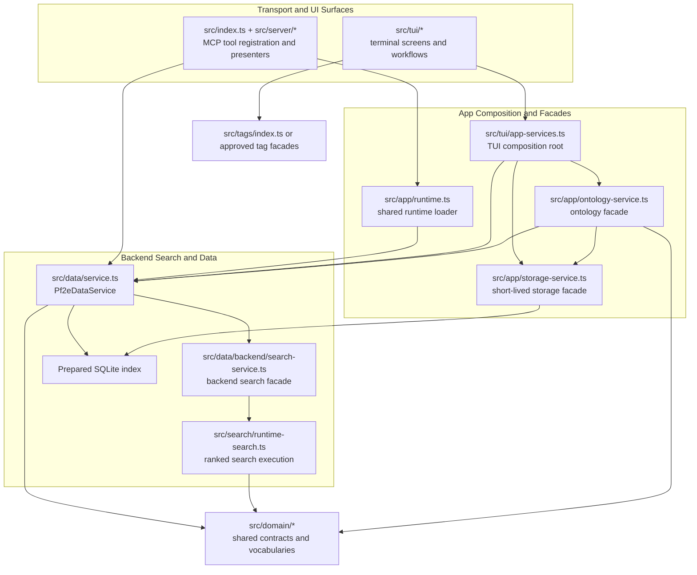

# Architectural Boundaries

This document records the architectural boundaries that future human and AI editors are expected to preserve. In this repository, "boundary" does not just mean design intent. Many of these rules are encoded directly in `eslint.config.js` and `eslint-local-rules.js`, so bypassing them is an architecture violation, not a style choice.

The guiding rule is simple: once the repo has a stable shared abstraction, new code should go through that abstraction instead of reopening the lower-level path. If that path is meant to stay mandatory, the lint config should make the boundary explicit.

## Approved Layering

The current codebase is intentionally layered around a small set of composition roots and service facades.

What this diagram means in practice:

- `src/server/` should stay thin and call `Pf2eDataService` instead of importing low-level search or storage internals.
- `src/tui/` should consume composed services from `src/tui/app-services.ts`, not recreate runtime assembly or open SQLite directly.
- `src/app/` owns cross-surface facades such as ontology assembly and app-scoped storage helpers.
- `src/data/` and `src/search/` own backend retrieval mechanics.
- `src/domain/` stays transport-agnostic and dependency-light.
- `src/tags/` is its own subsystem; non-tag code should enter through a tag facade instead of arbitrary leaf modules.

## How The Lint-Enforced Architecture Works

The repo uses three different enforcement styles, and they mean different things:

- `arch/*` custom rules in `eslint-local-rules.js` ban specific low-level operations anywhere except an explicit allowlist.
- `no-restricted-imports` in `eslint.config.js` blocks import paths for selected folders or files. This is the main tool for layer ownership.
- `no-restricted-syntax` is used when the boundary is not just "which file may import what", but also "which API pattern or workflow shape is allowed here".

When a lint error fires, the right response is usually not to widen the exception list. The first question is: "Which facade or shared helper is this file supposed to go through instead?"

## Concrete Lint-Enforced Boundaries

The table below is the shortest accurate summary of the current enforced boundaries.

| Boundary | Approved owners | What lint blocks | What callers should do instead |
| --- | --- | --- | --- |
| JSON decoding | Explicit decoders and boundary modules such as `src/data/sql-row-decoding.ts`, `src/data/rows.ts`, `src/search/ranking-config.ts`, tag session/discovery decoders, and `src/tui/ontology-explorer/data.ts` | `arch/no-direct-json-parse` bans ad hoc `JSON.parse` in most of `src/` | Add decoding to an approved boundary module, then pass structured values upward |
| SQLite construction | `src/data/schema.ts`, `src/app/storage-service.ts`, `src/refresh-index.ts`, `src/tags/migration/cli-utils.ts`, and `src/tags/cli/**` | `arch/no-direct-database-sync-construction` bans `new DatabaseSync(...)` almost everywhere else | Use `Pf2eDataService`, `Pf2eApplicationStorageService`, or another approved facade |
| Raw TUI event decoding | Shared TUI framework files plus a few approved routing helpers | `arch/no-direct-terminal-event-routing` bans branching on `event.systemAction`, `event.textInputAction`, `event.printable`, `isBackNavigationKey()`, and `isTerminalQuitKey()` in feature code | Route through shared interaction helpers, prompt adapters, or screen controllers |
| Server-to-storage shortcuts | No server registration files | `src/server/**/*` cannot import `src/search/sql.ts`, `src/data/record-queries.ts`, or `src/data/schema.ts` | Put reusable behavior behind `Pf2eDataService` or another backend facade, then call it from the server layer |
| Search-to-storage leaf imports | No search modules | `src/search/**/*` cannot import `src/data/rows.ts`, `src/data/record-queries.ts`, or `src/data/schema.ts` directly | Keep runtime search logic independent of storage leaf helpers unless the facade boundary changes intentionally |
| Non-tag imports of tag internals | No non-tag module outside an approved facade | Most non-tag code cannot import `src/tags/runtime/**`, `authored-rules/**`, `catalog/**`, `ontology/**`, `exemplars/**`, `legacy-rules/**`, or `legacy-seed-migrations/**` | Re-export through `src/tags/index.ts` or a dedicated approved facade |
| Non-UI imports of TUI internals | `src/tui/**` and a few explicitly allowed modules only | Application, data, domain, search, server, and most tag modules cannot import `src/tui/**` internals | Keep TUI concerns inside the TUI layer |
| TUI runtime composition | `src/tui/app-services.ts` and a few explicit exceptions | Most `src/tui/**` files cannot import `node:sqlite`, `src/data/service.ts`, `src/app/runtime.ts`, `src/app/ontology-service.ts`, or tag workbench internals directly | Extend `app-services` or a TUI-facing facade, then consume that facade from screens/workflows |

## Boundary Areas

### Composition Roots

There are two primary runtime assembly points:

- `src/index.ts` for the MCP server
- `src/tui/app-services.ts` for the terminal app

Feature modules should not create their own parallel runtime assembly. If a new surface or workflow needs more services, extend the relevant composition root or an adjacent facade.

### Storage Boundary

Direct `DatabaseSync` construction is intentionally scarce. The enforced ownership split is:

- `src/data/` owns the long-lived backend runtime through `Pf2eDataService`
- `src/app/storage-service.ts` owns short-lived app-layer index access for workflows that need direct DB access
- selected CLI and refresh entrypoints may own their own justified openings

This keeps connection lifetime, read/write policy, and schema-touching behavior centralized.

### Search Boundary

Search execution should flow through backend services instead of one-off SQL or ranking paths:

1. callers build or normalize `SearchFilters`
2. callers go through `Pf2eDataService`
3. `Pf2eSearchBackendService` coordinates execution
4. `src/search/runtime-search.ts` owns ranked runtime search behavior

That is why server registration files are blocked from importing low-level SQL/query helpers directly, and why search modules are blocked from reaching into storage leaf modules.

### Ontology Boundary

Ontology browsing is an app-layer concern assembled by `src/app/ontology-service.ts` from focused builders under `src/app/ontology/`.

Important expectations:

- load ontology domains through `createPf2eApplicationOntologyService`
- treat ontology nodes as readonly browse models
- keep helper caches alongside ontology helpers rather than mutating shared nodes from UI code
- move shared vocabulary into `src/domain/` when the concept is no longer ontology-specific

The lint config also contains ontology-specific syntax guards in `src/app/ontology-service.ts` to keep search semantics output aligned with the final browse model instead of regressing toward ad hoc example-only nodes.

### TUI Boundary

The terminal app has two layers of protection.

First, TUI feature code should consume explicit facades such as:

- `src/tui/app-services.ts`
- `src/tui/search-service.ts`
- `src/app/ontology-service.ts`
- tag workbench services routed through `app-services`

Second, TUI feature code should use shared framework primitives instead of rebuilding low-level input handling. That is why the lint config bans many direct imports from:

- `ink`
- `src/tui/keymap.ts`
- raw `terminal-ui` list/input helpers
- raw prompt APIs in selected search and ontology workflows

Those rules are not cosmetic. They encode a deliberate push toward reusable controllers, interaction routers, and screen-model helpers.

### Domain Boundary

`src/domain/` should remain:

- transport-agnostic
- UI-agnostic
- storage-lifecycle-agnostic

It is the right home for shared contracts, category vocabularies, metadata semantics, and ontology types. If code needs runtime composition, SQL access, prompt handling, or wire formatting, it belongs above the domain layer.

### Tag Boundary

`src/tags/` is a large editorial subsystem. Outside that tree, code should usually depend on `src/tags/index.ts` or another approved tag-facing facade instead of leaf modules.

This matters because the tag subsystem is still evolving internally. Stable facades let the rest of the repo depend on it without taking on that churn.

## How To Read A Boundary Failure

When lint reports a boundary violation, use this triage order:

1. Identify the owning layer of the behavior you are trying to add.
2. Check whether a facade for that layer already exists.
3. If it exists, move the behavior behind that facade instead of widening the rule.
4. If it does not exist, add the smallest new facade that gives callers a stable path.
5. Only then decide whether the new path should become lint-enforced for future callers.

Good architecture changes usually reduce the number of files that know about a low-level detail. If a fix adds a new exception to the lint config without shrinking coupling elsewhere, it is probably the wrong fix.

## When To Add Or Tighten A Boundary Rule

Add or extend a lint rule when all of the following are true:

- there is now a clearly preferred shared abstraction
- bypassing it would create duplication, drift, or lifecycle bugs
- the abstraction is stable enough that new code should not treat direct access as acceptable
- the exception list is short and defensible

Use the enforcement mechanism that matches the actual problem:

- use `arch/*` rules for low-level operations that should be rare everywhere
- use `no-restricted-imports` for ownership and layering boundaries
- use `no-restricted-syntax` for workflow-specific API use, copy, or controller patterns

For a practical guide to choosing an owner, adding a facade, and deciding when new lint enforcement is warranted, see `docs/architecture/extending.md`.
