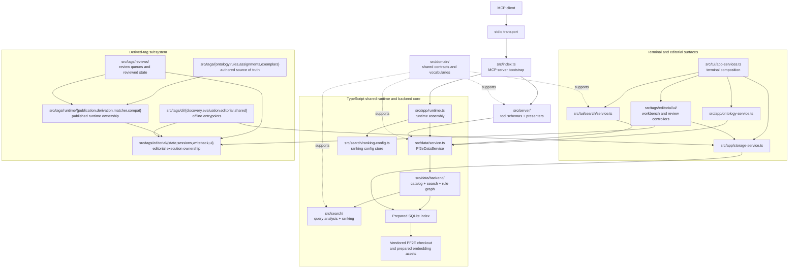

# TypeScript Runtime Architecture

This document describes the TypeScript/Node implementation under `src/`. It remains the established MCP, terminal, search, and editorial runtime while the Rust implementation is built out, but it is no longer the target shape for new Rust runtime decisions. Rust-specific ownership lives in the root [runtime architecture](../runtime.md) and [artifact contract](../artifact-contract.md).

## Status

The TypeScript runtime is the legacy product runtime. It owns the current MCP server, terminal/editorial surfaces, and the mature index-backed service stack. New architecture decisions for Rust should not be inferred from this layout when the Rust docs define a different owner.

## System Shape

## Ownership Map

- `src/index.ts` is the MCP composition root.
- `src/tui/app-services.ts` is the terminal/editorial composition root.
- `src/app/` wires runtime and app-level facades together.
- `src/data/` owns index-backed catalog, search, and rule-graph access.
- `src/data/indexing/` owns the TypeScript index rebuild pipeline and stage artifacts.
- `src/search/` owns reusable ranked-search mechanics.
- `src/server/` translates MCP tools to backend calls.
- `src/tui/` translates terminal workflows to backend and app services.
- `src/tags/` owns derived-tag runtime, review, editorial, and offline tooling.
- `src/domain/` defines shared TypeScript vocabulary and contracts.

## Boundary Rule

Transport and UI layers stay thin. Shared retrieval behavior flows through `Pf2eDataService` and app-level facades instead of being rebuilt in MCP handlers or TUI screens.

## Relationship To Rust

The Rust implementation does not mirror this structure one-for-one. The Rust crates split source ingest, normalized records, artifact schema, artifact reading, embedding, search orchestration, path/runtime setup, CLI presentation, and sqlite-vec registration into separate crates. When Rust docs and TypeScript docs disagree, treat that as an implementation split, not an inconsistency by itself.
