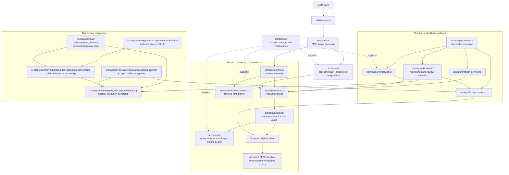
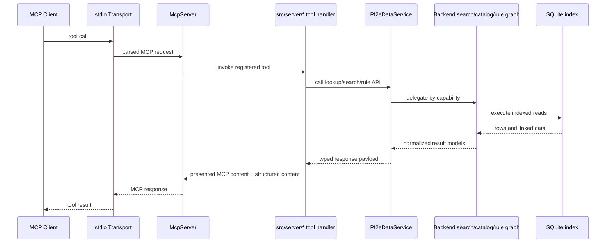
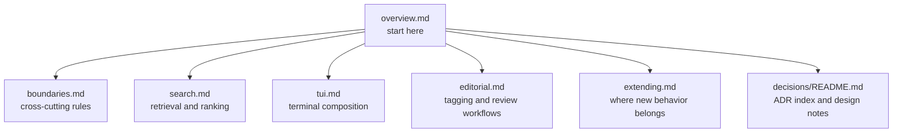

# Architecture Overview

This is the front door for the project architecture. Read it first when you need to understand how the MCP server, the shared data runtime, the terminal UI, and the editorial tooling fit together. Then follow the links into the focused documents for the subsystem you are changing.

## What This System Is

This repository has one shared core and multiple execution surfaces:

- a read-only MCP server over a prepared local PF2E SQLite index
- a terminal UI for search, ontology browsing, and local workflows
- an editorial/tooling surface for derived-tag discovery, migration, and review

Those surfaces intentionally share the same backend data runtime instead of maintaining parallel retrieval stacks. The main architectural goal is to keep storage, normalization, lookup, rule graph, and search logic reusable while allowing each surface to evolve at its own boundary.

## At A Glance

The shortest useful mental model is:

- `src/index.ts` is the MCP composition root
- `src/tui/app-services.ts` is the terminal/editorial composition root
- `src/app/` wires runtime and app-level facades together
- `src/data/` owns index-backed catalog, search, and rule-graph access
- `src/domain/search-request-types.ts` owns `SearchRequest`, the shared semantic search contract
- `src/domain/metadata-field-catalog.ts`, `src/domain/metadata-field-types.ts`, `src/domain/search-filter-metadata.ts`, and `src/domain/search-request-types.ts` own the shared metadata filter vocabulary carried by `SearchRequest`
- `src/search/` owns reusable ranked-search mechanics
- `src/server/` translates MCP tools to backend calls
- `src/tui/` translates user interaction flows to backend and app services
- `src/tags/runtime/` owns published derived-tag runtime assembly
- `src/tags/reviews/` owns durable review registries and reviewed discovery state
- `src/tags/editorial/` owns editorial state, session, writeback, and UI workflows
- `src/tags/cli/` groups offline discovery, evaluation, and editorial entrypoints
- `src/search/filters/` owns execution-time metadata normalization, matching, and SQL-facing filter assembly; public metadata field semantics stay in `src/domain/metadata-field-catalog.ts`
- `src/data/metadata-row-projection.ts` owns metadata row selection and hydration mapping for normalized records
- `src/search/request-compilation.ts` owns the lowering from `SearchRequest` into search-execution filters
- `src/tags/runtime.ts`, `src/tags/editorial.ts`, and `src/tags/editorial-ui.ts` are the approved non-tag tag facades
- `src/domain/` defines shared vocabulary and contracts
- `src/shared/` stays intentionally small and only holds true cross-layer primitives

If you remember only one rule, remember this one: transport and UI layers should stay thin, and shared retrieval behavior should flow through `Pf2eDataService` and the app-level facades instead of being rebuilt ad hoc.

## System Overview



## Execution Surfaces

### MCP Server

The public product surface is the stdio MCP server in `src/index.ts`. It:

1. loads config and ranking state via `src/app/runtime.ts`
2. creates one long-lived `Pf2eDataService`
3. registers lookup, search, and rules tools from `src/server/`
4. serves requests over stdio using thin tool handlers

The server layer should own wire concerns such as schemas, descriptions, and response presentation. It should not own ranking policy, SQL access, or new storage lifecycles.

### Terminal UI

The terminal application composes on top of the same runtime through `src/tui/app-services.ts`. It adds:

- ontology browsing via `src/app/ontology-service.ts`
- search workflow orchestration via `src/tui/search/service.ts` and `src/tui/search/`
- terminal framework and navigation state in `src/tui/framework/` and nearby screens

The TUI is a consumer of the shared runtime, not a second backend.

### Editorial And Tagging Tooling

The editorial subsystem under `src/tags/` is large because it supports assignment logic, candidate discovery, migration sessions, review queues, and CLI workflows. Architecturally, what matters here is:

- authored truth lives in `ontology/`, `rules/`, `assignments/`, `exemplars/`, and `reviews/`
- published runtime ownership is split across `runtime/publication/`, `runtime/derivation/`, `runtime/matcher/`, and `runtime/compat/`
- durable reviewed discovery negatives now live under `src/tags/reviews/discovery-reviewed-records.ts`, alongside the other review registries
- editorial execution is split by concern under `editorial/state/`, `editorial/sessions/`, `editorial/writeback/`, and `editorial/ui/`
- offline tooling is grouped under `cli/discovery/`, `cli/evaluation/`, `cli/editorial/`, and `cli/shared/`
- non-editorial code should prefer `src/tags/runtime.ts`, `src/tags/editorial.ts`, or `src/tags/editorial-ui.ts` over arbitrary imports into tag leaf modules

See [`editorial.md`](./editorial.md) for the deeper breakdown of the editorial subsystem.

## Layer Responsibilities

### `src/domain/`

Owns low-level shared vocabulary and contracts:

- categories and subcategories
- metadata semantics and predicate specs
- search and rule graph types
- ontology contracts and related shared type definitions

There is no approved broad `src/domain/index.ts` import path. Import the owning `src/domain/*` module directly when code needs a domain contract.

This layer should stay free of transport, UI, and storage-lifecycle behavior.

### `src/shared/`

Owns a tiny set of true cross-layer primitives.

- keep stable low-level helpers here only when multiple layers genuinely share them
- do not treat `src/shared/` as the default home for convenience helpers once `app`, `data`, or `search` clearly owns the concern
- moved non-tag helpers should stay with their owner modules instead of growing compatibility imports back into shared barrels

### `src/data/`

Owns index-backed retrieval and normalized record access:

- `Pf2eDataService` as the main backend facade
- backend catalog, search, rule-graph, and generic reference-edge services in `src/data/backend/`
- normalization, row decoding, indexing, and schema helpers

This layer also owns its record/raw-value helper pathways such as normalization, nested-value extraction, and formatting helpers that were previously reachable through broader shared modules.

This is the core boundary between the rest of the application and low-level SQLite-backed access.

### `src/search/`

Owns reusable ranked-search mechanics:

- query analysis and normalization
- ranking configuration
- runtime search execution
- lexical and semantic scoring coordination

Search-specific primitives such as limit/offset clamping and lexical scoring belong here once they are part of the search runtime rather than general shared infrastructure.

If logic is reusable across MCP and TUI search paths, it probably belongs here or in `src/data/backend/`, not in a handler or screen.

### `src/app/`

Owns application-level composition and facades:

- runtime assembly in `runtime.ts`
- storage boundary in `storage-service.ts`
- ontology assembly in `ontology-service.ts` and `ontology/`
- shared entity-page document and page-text presentation ownership in `ontology/entity-page.ts`, with normalized page facts projected by `ontology/entity-page-facts.ts`, `ontology/entity-page-service.ts` as the relation-aware app facade, and `ontology/presenter.ts` as the durable plain-line presentation seam for non-page consumers
- page-relation grouping and seeded drill preparation in `page-relations-service.ts`

This layer exists so product surfaces do not have to know how to construct storage, vocabulary, or shared models themselves.

### `src/server/`

Owns MCP transport concerns:

- tool registration
- schema descriptions
- response shaping and presentation

It should translate between the MCP SDK and `Pf2eDataService`, not create competing backend logic.

### `src/tui/`

Owns terminal interaction concerns:

- user workflows and state machines
- terminal framework helpers
- UI-facing service adapters

It should consume explicit facades rather than reach directly into storage or low-level backend internals.

### `src/tags/`

Owns the editorial subsystem:

- authored tag knowledge in `ontology/`, `rules/`, `assignments/`, `exemplars/`, and `reviews/`
- published runtime assembly in `runtime/publication/`, `runtime/derivation/`, `runtime/matcher/`, and `runtime/compat/`
- editorial state, session, writeback, and review UI flows under `editorial/`
- discovery and evaluation tooling plus grouped CLI entrypoints

This area evolves faster than the public MCP surface, so its internal structure may change more often. The important boundary is stable entrypoints and respect for shared storage/runtime seams.

## Runtime Composition

There are two composition roots and one shared backend runtime.

### Shared Backend Runtime

`src/app/runtime.ts` is the common assembly layer. It:

1. loads configuration
2. opens the ranking config store
3. calls `Pf2eDataService.load(...)`
4. returns the shared runtime handle used by higher-level surfaces

That runtime bundles config, startup warnings, pack and record stats, and a close hook. Both the server and the terminal stack build on top of it.

### MCP Composition Root

`src/index.ts` is intentionally small. Its job is to:

1. load the shared runtime
2. create the `McpServer`
3. register the tool families in `src/server/`
4. connect the stdio transport

If `src/index.ts` starts to contain feature logic, that is usually a sign the logic belongs elsewhere.

### Terminal Composition Root

`src/tui/app-services.ts` takes the shared runtime and layers on:

- `createPf2eApplicationStorageService` for explicit direct-index workflows
- `createPf2eApplicationOntologyService` for the cached search-semantics browse model
- `createPf2eTerminalSearchService`
- tag workbench services wired through storage-backed helpers

This is what lets the terminal/editorial surface reuse the backend while still having terminal-specific service contracts.

## MCP Request Flow

The request lifecycle below is the main product path to keep in mind when changing lookup, search, or rules behavior.



A few implications follow from that flow:

- request schemas belong in `src/server/`
- reusable retrieval behavior belongs below the tool handlers
- normalization should happen once in shared backend paths, not once per caller
- result presentation can differ by surface, but the underlying data access path should stay centralized

## Shared Data And Storage Model

The project is intentionally offline-first at runtime:

- PF2E source data is expected locally under `vendor/pf2e` by default
- embeddings are prepared locally when semantic search is enabled
- the server and TUI read from a prepared SQLite index rather than rebuilding it on startup

That means normal request handling is read-only and low-churn:

- startup validates and opens prepared resources
- steady-state request handling executes indexed reads
- refresh and rebuild operations happen explicitly through maintenance commands, not during normal MCP traffic

The most important storage split is:

- long-lived data runtime lives behind `Pf2eDataService`
- short-lived direct index access for app workflows goes through `src/app/storage-service.ts`

This keeps `DatabaseSync` construction from spreading through the codebase.

## Architectural Intent

Recent refactors point in a clear direction that future edits should preserve:

- prefer focused modules over large multipurpose service files
- prefer facades between layers over direct leaf imports
- prefer readonly shared models where consumers should browse rather than mutate
- prefer lint-enforced boundaries once a shared pathway is mature

The details may move, but those design choices are the stable intent.

## How To Navigate The Architecture Docs

Use this page as the map, then jump to the document closest to your change.



### Architecture Reading Order

If you are new to the repo, use this sequence:

1. read [`README.md`](../../README.md)
2. read this overview
3. read [`boundaries.md`](./boundaries.md)
4. jump to the focused doc for your subsystem:
   - [`search.md`](./search.md)
   - [`tui.md`](./tui.md)
   - [`editorial.md`](./editorial.md)
   - [`extending.md`](./extending.md)
   - [`decisions/README.md`](./decisions/README.md)
5. inspect the relevant composition root:
   - `src/index.ts` for MCP changes
   - `src/tui/app-services.ts` for terminal/editorial changes
6. find the owning facade before touching leaf modules

### Which Document To Open Next

- Open [`boundaries.md`](./boundaries.md) when you need to know what is intentionally restricted or lint-enforced.
- Open [`search.md`](./search.md) when you are changing ranking, filter behavior, or retrieval flow.
- Open [`tui.md`](./tui.md) when you are changing terminal composition, navigation, or TUI service seams.
- Open [`editorial.md`](./editorial.md) when you are changing derived-tag workflows, review tooling, or migration flows.
- Open [`extending.md`](./extending.md) when you are deciding where a new feature or abstraction belongs.
- Open [`decisions/README.md`](./decisions/README.md) when a design choice depends on previous architectural commitments.

## Editing Guidance

When adding or moving behavior, prefer the lowest layer that can own the work without importing higher-level concerns.

- MCP-only presentation changes belong in `src/server/`
- reusable retrieval logic belongs in `src/search/` or `src/data/backend/`
- app-level service wiring belongs in `src/app/`
- terminal interaction behavior belongs in `src/tui/`
- stable shared vocabulary belongs in `src/domain/`

If a new shared abstraction is meant to become the normal path through the codebase, update the lint rules once that path is stable enough to enforce.

## Validation Expectations

The full repo gate is:

```bash
cd scripts && npm run verify
```

For documentation-only changes, still run at least the project build and test suite before landing work so the branch state is known-good.
