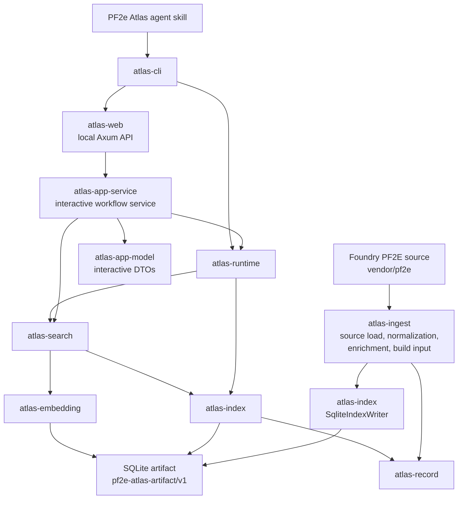

# Architecture Overview

PF2e Atlas is a Rust workspace that builds and queries a local SQLite artifact from the Foundry PF2E source data. The primary product surfaces are the `atlas` CLI, the local web service launched by `atlas web`, and the first-party local-agent skill package installed by `atlas agent skills`.

Read this document first when you need to understand crate ownership, then follow the focused docs:

- [Runtime architecture](./runtime.md): crate ownership, ingest flow, content/search/reference projections, and runtime query flow.
- [Artifact contract](./artifact-contract.md): SQLite schema, table families, validation contract, and embedding/vector artifact boundary.
- [Tagging architecture](./tagging.md): Rust-owned tag ontology, assignment corpus, agent workflow, context packets, and future `record_tags` artifact integration.
- [Architecture decisions](./decisions/README.md): accepted durable design decisions.

## Crate Map

- `atlas-app-model` owns interactive app DTOs for local web/TUI-style workflows, including app errors, readiness, basic filters, result windows, and record view wrappers. It is the default Rust-to-TypeScript export boundary for app contracts.
- `atlas-app-service` owns long-lived interactive workflow orchestration over `atlas-runtime` and `atlas-search`. It opens one full retrieval service through runtime setup/readiness policy, owns result windows, lowers app filters to canonical filters, and exposes native methods to web and future TUI surfaces.
- `atlas-web` owns the Axum local HTTP surface, adapting `/api/*` routes and future static frontend serving to `atlas-app-service`.
- `atlas-cli` owns command parsing, output, progress, exit codes, `atlas web` startup, and agent skill installation.
- `atlas-runtime` owns path/setup policy and runtime handle construction.
- `atlas-search` owns retrieval orchestration, filter discovery orchestration, and result assembly.
- `atlas-index` owns artifact validation, Diesel-backed relational schema and migrations, row readers, SQLite artifact writing, filter discovery, filter compilation, reference queries, and vector SQL. Its crate root exposes only the hooks needed by ingest, runtime, search, and CLI artifact diagnostics; product CLI workflows route through `atlas-search` rather than index readers. Artifact, read, write, and SQLite implementation details stay behind internal module facades.
- `atlas-embedding` owns model catalog, embedding text rendering, token budgeting, document units, and query/document vectors.
- `atlas-tags` will own tag ontology, YAML parsing, applicability, assignment validation, evidence validation, ontology suggestions, and agent contract DTOs once the first tagging implementation slice lands.
- `atlas-ingest` owns source loading, Foundry parsing, normalization, enrichment, generation, reference resolution, retrieval visibility, embedding execution during builds, and handoff into index-owned artifact writers.
- `atlas-record` owns normalized records, `RichDocument`, presentation contracts, FTS projection, graph/reference policy, and section-tree projection.
- The former `atlas-artifact` crate has been retired; SQLite artifact schema ownership lives in `atlas-index` so the crate that validates, reads, and writes the artifact owns the database contract.
- `atlas-domain` owns shared request, filter, record-key, detail-level, and metadata vocabulary, including the simple product filter DTO and its one-way lowering into the canonical `SearchFilterNode` tree.
- `atlas-sqlite-vec` owns sqlite-vec registration and capability probing.

If you remember one rule, remember this: product surfaces stay thin, and durable behavior belongs in the crate that owns the concern.

## System Overview

## Product Surfaces

### CLI

`atlas-cli` is the user and agent command surface. It owns:

- command parsing
- JSON and terminal output
- progress output
- exit codes
- shell completions
- first-party agent skill installation and diagnostics

It should not own durable retrieval semantics, filter discovery behavior, SQLite schema, model execution policy, or artifact mutation rules.

### Local Web Service

`atlas web` starts a long-lived localhost service for the interactive web app. CLI startup owns process flags such as path overrides, port selection, and `--open`; `atlas-web` owns HTTP routing; `atlas-app-service` owns long-lived retrieval workflow state.

The app service opens a full `AtlasRetrievalService` through `AtlasRuntime::open_retrieval_service` and should fail startup when artifact, vector, or embedding readiness is not satisfied. It must not use `open_retrieval_service_no_embeddings`, which remains a CLI-only shortcut for short-lived commands that do not need semantic retrieval.

### Agent Skill

The first-party PF2e Atlas CLI skill lives under `skills/pf2e-atlas-cli` and is packaged by `atlas-cli`. The skill teaches local agents how to choose between record lookup, strict resolution, search, graph context, filter discovery, and readiness diagnostics.

Skill guidance should use installed `atlas` commands. Contributor-only `cargo run ...` examples belong in contributor docs, not normal skill instructions.

### Future TUI

A future Ratatui workbench should consume `atlas-app-model` and `atlas-app-service` for shared interactive workflow contracts. TUI screen code should not open SQLite, load embedding models, or duplicate artifact/readiness policy.

### Tags

Tags are a planned Rust-owned product surface with an accepted architecture model. Tags are global concepts with typed applicability over record kind, optional Foundry record type refinements, and small normalized fact predicates. They are authored as YAML, assigned through an agent-first workflow, and will become authoritative runtime filters through `record_tags` rows written during regular `atlas index build`.

See [Tagging architecture](./tagging.md) and [ADR 0028](./decisions/0028-rust-tagging-model.md).

## Data Flow

1. `atlas-ingest` loads Foundry PF2E source data from `vendor/pf2e` or the resolved global source path.
2. Ingest normalizes source records, parses rich content into `RichDocument`, resolves rich-content references, extracts traits/metrics/aliases, generates source-backed records, runs build-time embedding work, and prepares `IndexBuildInput`.
3. `atlas-index` writes the complete SQLite artifact through `IndexArtifactWriter` implementations such as `SqliteIndexWriter`.
4. `atlas-runtime` resolves source, embedding cache, and artifact paths for setup and query commands.
5. `atlas-index` opens completed artifacts read-only, validates contract/readiness, and provides typed row/query APIs.
6. `atlas-search` orchestrates lookup, search, graph context, lexical/vector retrieval, and result assembly.
7. `atlas-cli` presents command results and errors through stable terminal or JSON output, or starts the local Axum web service through `atlas web`.
8. `atlas-app-service` holds long-lived retrieval state for interactive sessions and adapts app DTOs into `atlas-search` requests.
9. `atlas-web` exposes app-service workflows through local JSON routes for the TypeScript frontend.

## Editing Guidance

- Keep `atlas-cli` thin. Durable search, lookup, graph, validation, setup, and artifact behavior belongs below the CLI.
- Keep `atlas-app-model` thin. It should contain interactive workflow DTOs and generated TypeScript contracts, not duplicate domain logic or record presentation models.
- Run `cargo test -p atlas-app-model` after app DTO changes; it fails when checked-in TypeScript bindings drift. Regenerate bindings intentionally with `cargo test -p atlas-app-model export_typescript_bindings -- --ignored`.
- Keep `atlas-app-service` behind runtime/search boundaries. It should not import `atlas-index`, assemble SQLite readers, or use no-embeddings retrieval shortcuts.
- Keep `atlas-web` as transport glue. It adapts HTTP requests/errors to app-service methods and should not own retrieval semantics.
- Keep `atlas-cli/src/main.rs` as the binary entrypoint only. Top-level command composition and dispatch belong in `atlas-cli/src/cli.rs`; shared CLI argument groups and parsers belong under `atlas-cli/src/cli/`; command-specific argument grammar, execution, and presentation belong under `atlas-cli/src/commands/`.
- Keep `atlas-ingest/src/lib.rs` as a facade. New ingest policy belongs under the phase that owns it.
- Keep the SQLite artifact contract in `atlas-index`. Diesel migrations are the physical schema source of truth, checked-in Diesel schema declarations must stay validated against them, and typed schema models should own ordinary relational tables; explicit raw SQL remains appropriate for FTS5, sqlite-vec, dynamic filter/discovery relations, and SQLite validation pragmas. Filter discovery field metadata and SQLite extractor rendering belong inside `atlas-index`; shared discovery result DTOs belong in `atlas-domain`.
- Keep `atlas-record` storage-agnostic. It should not own SQLite names, validation diagnostics, CLI envelopes, or source JSON parser structs.
- Keep `atlas-domain` free of SQLite, CLI presentation, ingest source structs, and artifact metadata inventories.
- Add future crates only when their first real implementation slice lands.

## Further Reading

- [Runtime architecture](./runtime.md)
- [Artifact contract](./artifact-contract.md)
- [Tagging architecture](./tagging.md)
- [Architecture decisions](./decisions/README.md)
