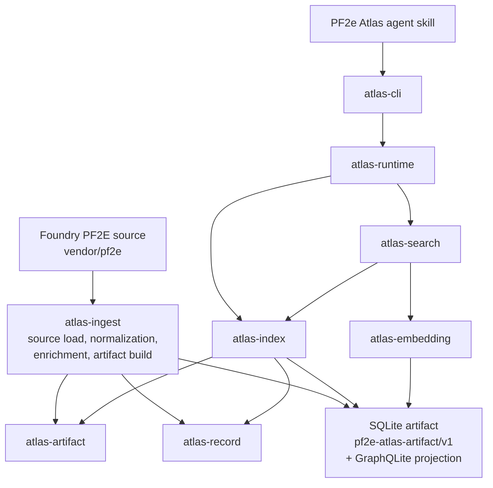

# Architecture Overview

PF2e Atlas is a Rust workspace that builds and queries a local SQLite artifact from the Foundry PF2E source data. Current Rust-written SQLite artifacts also include an embedded GraphQLite graph projection for graph-retrieval evaluation. The primary product surface is the `atlas` CLI plus the first-party local-agent skill package installed by `atlas agent skills`.

Read this document first when you need to understand crate ownership, then follow the focused docs:

- [Runtime architecture](./runtime.md): crate ownership, ingest flow, content/search/reference projections, and runtime query flow.
- [Artifact contract](./artifact-contract.md): SQLite schema, table families, validation contract, and embedding/vector artifact boundary.
- [Architecture decisions](./decisions/README.md): accepted durable design decisions.

## Crate Map

- `atlas-cli` owns command parsing, output, progress, exit codes, and agent skill installation.
- `atlas-runtime` owns path/setup policy and runtime handle construction.
- `atlas-search` owns retrieval orchestration and result assembly.
- `atlas-index` owns index backend contracts plus read/write implementations, including SQLite artifact validation, row readers, filter compilation, reference queries, vector SQL, reusable embedding-cache reads, backend-neutral build/write contracts, SQLite artifact writing, the embedded GraphQLite projection writer, and the experimental Ladybug graph backend.
- `atlas-embedding` owns model catalog, embedding text rendering, token budgeting, document units, and query/document vectors.
- `atlas-ingest` owns source loading, Foundry parsing, normalization, enrichment, generation, reference resolution, retrieval visibility, embedding execution during builds, and conversion to backend-neutral index build input.
- `atlas-record` owns normalized records, `ContentDocument`, presentation contracts, FTS projection, graph/reference policy, and section-tree projection.
- `atlas-artifact` owns physical SQLite table/column descriptors, schema SQL, vector blob encoding, and contract constants.
- `atlas-discovery` owns filter discovery field and value policy.
- `atlas-domain` owns shared request, filter, record-key, detail-level, and metadata vocabulary.
- `atlas-sqlite-vec` owns sqlite-vec registration and capability probing.

If you remember one rule, remember this: product surfaces stay thin, and durable behavior belongs in the crate that owns the concern.

## System Overview

## Product Surfaces

### CLI

`atlas-cli` is the user and agent command surface. It owns:

- command parsing
- JSON and terminal output
- progress output
- exit codes
- shell completions
- first-party agent skill installation and diagnostics

It should not own durable retrieval semantics, SQLite schema, model execution policy, or artifact mutation rules.

### Agent Skill

The first-party PF2e Atlas CLI skill lives under `skills/pf2e-atlas-cli` and is packaged by `atlas-cli`. The skill teaches local agents how to choose between record lookup, strict resolution, search, graph context, filter discovery, and readiness diagnostics.

Skill guidance should use installed `atlas` commands. Contributor-only `cargo run ...` examples belong in contributor docs, not normal skill instructions.

### Future TUI

A future Ratatui workbench should consume the Rust runtime crates through `atlas-runtime`, `atlas-search`, `atlas-index`, and `atlas-record`. Screen code should not open SQLite, load embedding models, or duplicate artifact/readiness policy.

### Future Derived Tags

Derived tags are a planned Rust redesign. The retained model should be defined against record families, explicit metadata axes, typed filter discovery, and Rust artifact ownership before adding an `atlas-tags` crate or persisted tag rows.

## Data Flow

1. `atlas-ingest` loads Foundry PF2E source data from `vendor/pf2e` or the resolved global source path.
2. Ingest normalizes source records, parses rich content into `ContentDocument`, extracts references/traits/metrics/aliases, generates source-backed records, prepares embedding units, then hands normalized index-build inputs to configured artifact writers.
3. `atlas-runtime` resolves source, embedding cache, and artifact paths for setup and query commands.
4. `atlas-index` opens completed index artifacts read-only, validates contract/readiness, and provides typed backend query APIs. The SQLite artifact remains the current production contract; Rust builds also embed a GraphQLite projection for graph comparison, while the Ladybug graph backend is spike-only.
5. `atlas-search` orchestrates lookup, search, graph context, lexical/vector retrieval, and result assembly.
6. `atlas-cli` presents command results and errors through stable terminal or JSON output.

## Editing Guidance

- Keep `atlas-cli` thin. Durable search, lookup, graph, validation, setup, and artifact behavior belongs below the CLI.
- Keep `atlas-ingest/src/lib.rs` as a facade. New ingest policy belongs under the phase that owns it.
- Keep concrete read-backend implementations under `atlas-index`; `atlas-search` should orchestrate product retrieval through backend-neutral contracts rather than owning SQLite or Ladybug adapters.
- Keep `atlas-artifact` as the single owner of physical table/column descriptors and artifact constants.
- Keep `atlas-record` storage-agnostic. It should not own SQLite names, validation diagnostics, CLI envelopes, or source JSON parser structs.
- Keep `atlas-domain` free of SQLite, CLI presentation, ingest source structs, and artifact metadata inventories.
- Add future crates only when their first real implementation slice lands.

## Further Reading

- [Runtime architecture](./runtime.md)
- [Artifact contract](./artifact-contract.md)
- [Architecture decisions](./decisions/README.md)
