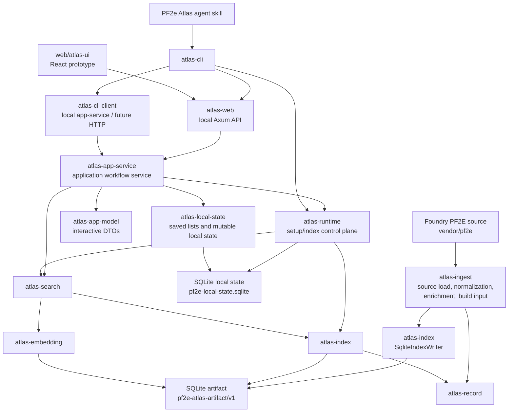

# Architecture Overview

PF2e Atlas is a Rust workspace that builds and queries a local SQLite artifact from the Foundry PF2E source data. The primary product surfaces are the `atlas` CLI, the local web service launched by `atlas web`, and the first-party local-agent skill package installed by `atlas agent skills`.

Read this document first when you need to understand crate ownership, then follow the focused docs:

- [Runtime architecture](./runtime.md): crate ownership, ingest flow, content/search/reference projections, and runtime query flow.
- [Artifact contract](./artifact-contract.md): SQLite schema, table families, validation contract, and embedding/vector artifact boundary.
- [Tagging architecture](./tagging.md): Rust-owned tag ontology, assignment corpus, agent workflow, context packets, and future `record_tags` artifact integration.
- [Architecture decisions](./decisions/README.md): accepted durable design decisions.

## Crate Map

- `atlas-app-model` owns interactive app DTOs for local web/TUI-style workflows, including app errors, readiness, filter editor contracts, basic filters, result windows, and record view wrappers. It is the default Rust-to-TypeScript export boundary for app contracts.
- `atlas-app-service` owns application workflow orchestration over `atlas-runtime`, `atlas-search`, and `atlas-local-state`. Web startup uses full pooled retrieval services through runtime setup/readiness policy; short-lived local CLI clients may choose explicit on-demand retrieval modes for workflows that do not need query embeddings. App-service owns result-window metadata, projects app filter editor groups/controls from product discovery, lowers app filters to canonical filters, hydrates saved-list rows from local state against the active artifact, and exposes native methods to web, CLI client, and future TUI surfaces.
- `atlas-web` owns the Axum local HTTP surface, adapting `/api/*` routes and future static frontend serving to `atlas-app-service`.
- `web/atlas-ui` owns the TypeScript/React frontend prototype. It consumes generated app DTOs, uses a thin API client over `atlas-web`, and uses Ant Design as the selected component library for the current web UI. It should not own retrieval semantics or duplicate Rust DTO contracts.
- `atlas-local-state` owns durable mutable local state stored outside the generated artifact, starting with saved-list schema, migrations, ordering, and item snapshots.
- `atlas-cli` owns command parsing, output, progress, exit codes, `atlas web` startup, and agent skill installation.
- `atlas-runtime` owns path/setup policy and runtime handle construction.
- `atlas-search` owns retrieval orchestration, filter discovery orchestration, and result assembly.
- `atlas-index` owns artifact validation, Diesel-backed relational schema and migrations, row readers, SQLite artifact writing, filter discovery, filter compilation, reference queries, and vector SQL. Its crate root exposes only the hooks needed by ingest, runtime, search, and CLI artifact diagnostics; product CLI workflows route through `atlas-search` rather than index readers. Artifact, read, write, and SQLite implementation details stay behind internal module facades.
- `atlas-embedding` owns model catalog, embedding text rendering, token budgeting, document units, and query/document vectors.
- `atlas-tags` owns tag ontology, YAML parsing, corpus loading, applicability, assignment validation, evidence validation, ontology suggestions, and agent contract DTOs.
- `atlas-ingest` owns source loading, Foundry parsing, normalization, enrichment, generation, reference resolution, retrieval visibility, embedding execution during builds, and handoff into index-owned artifact writers.
- `atlas-record` owns normalized records, `RichDocument`, presentation contracts, FTS projection, graph/reference policy, and section-tree projection.
- The former `atlas-artifact` crate has been retired; SQLite artifact schema ownership lives in `atlas-index` so the crate that validates, reads, and writes the artifact owns the database contract.
- `atlas-domain` owns shared request, filter, record-key, detail-level, and metadata vocabulary, including the simple product filter DTO and its one-way lowering into the canonical `SearchFilterNode` tree.
- `atlas-sqlite-vec` owns sqlite-vec registration and capability probing.

If you remember one rule, remember this: product surfaces stay thin, and durable behavior belongs in the crate that owns the concern.

## System Overview

```mermaid
flowchart TD
    pf2e["Foundry PF2E source<br/>vendor/pf2e"] --> ingest["atlas-ingest<br/>source load, normalization,<br/>enrichment, build input"]
    ingest --> indexWriter["atlas-index<br/>SqliteIndexWriter"]
    indexWriter --> artifactDb["SQLite artifact<br/>pf2e-atlas-artifact/v1"]
    localStateDb["SQLite local state<br/>pf2e-local-state.sqlite"]

    skill["PF2e Atlas agent skill"] --> cli["atlas-cli"]
    cli --> web["atlas-web<br/>local Axum API"]
    browser["web/atlas-ui<br/>React prototype"] --> web
    web --> appService["atlas-app-service<br/>application workflow service"]
    appService --> appModel["atlas-app-model<br/>interactive DTOs"]
    appService --> runtime
    appService --> search
    appService --> localState["atlas-local-state<br/>saved lists and mutable local state"]
    cli --> cliClient["atlas-cli client<br/>local app-service / future HTTP"]
    cliClient --> appService
    cli --> runtime["atlas-runtime<br/>setup/index control plane"]
    runtime --> search["atlas-search"]
    runtime --> index["atlas-index"]
    runtime --> localStateDb
    localState --> localStateDb
    search --> index
    search --> embedding["atlas-embedding"]
    index --> artifactDb
    embedding --> artifactDb
    ingest --> record["atlas-record"]
    index --> record
```

## Product Surfaces

### CLI

`atlas-cli` is the user and agent command surface. It owns:

- command parsing
- JSON and terminal output
- progress output
- exit codes
- shell completions
- first-party agent skill installation and diagnostics

It should not own durable retrieval semantics, filter discovery behavior, SQLite schema, model execution policy, or artifact mutation rules.

### Local Web Service

`atlas web` starts a long-lived localhost service for the interactive web app. CLI startup owns process flags such as path overrides, port selection, and `--open`; `atlas-web` owns HTTP routing; `atlas-app-service` owns long-lived retrieval workflow state.

For `atlas web`, the app service starts a bounded pool of full `AtlasRetrievalService` workers through `AtlasRuntime::open_retrieval_service` and should fail startup when artifact, vector, or embedding readiness is not satisfied. The CLI local client may start app-service in explicit on-demand modes: no-embeddings for record/list/filter/graph reads and stored-vectors for similar-record reads. Those modes are for short-lived local CLI workflows, not for the web service. `atlas-web` must apply explicit backpressure before dispatching blocking app-service work so frontend HTTP requests cannot accumulate in an unbounded transport-side queue ahead of the app-service executor. Saved-list web reads go through app-service methods that open the runtime-resolved local-state database and hydrate active records through the app-service retrieval pool, preserving unresolved local-state rows with snapshots.

`web/atlas-ui` is a Vite/React frontend package. Vite remains the frontend development and build tool, but normal `atlas web` usage serves the built frontend from `atlas-web` through embedded static assets. During frontend prototyping, contributors may still run the Vite dev server and proxy `/api/*` to the local `atlas-web` service for hot reload. The frontend imports the Rust-generated TypeScript DTO surface through `web/atlas-ui/src/generated/atlas.ts`; frontend code should use those generated contracts rather than hand-written duplicate app DTOs. The filter palette is driven by the app-owned `FilterEditorView` contract from `/api/filters/editor`; the frontend may own local visibility, pending values, URL state, and component rendering, but not field grouping, control kind, labels, placement, discovery-scope semantics, or option ordering policy. Authored filter state in the UI should use app-model `FilterClause` values directly, including range and metric comparison clauses, rather than parallel field-specific buckets.

### Agent Skill

The first-party PF2e Atlas CLI skill lives under `skills/pf2e-atlas-cli` and is packaged by `atlas-cli`. The skill teaches local agents how to choose between record lookup, strict resolution, search, graph context, filter discovery, and readiness diagnostics.

Skill guidance should use installed `atlas` commands. Contributor-only `cargo run ...` examples belong in contributor docs, not normal skill instructions.

### Future TUI

A future Ratatui workbench should consume `atlas-app-model` and `atlas-app-service` for shared interactive workflow contracts. TUI screen code should not open SQLite, load embedding models, or duplicate artifact/readiness policy.

### Local State

Durable mutable local state lives in a separate local-state SQLite database resolved beside the active generated artifact. The generated artifact remains rebuildable source-derived data; local state owns user-authored or agent-authored data such as saved lists.

Saved lists expose a stable generated `list_key` for product identity plus a unique user-friendly slug for URL, CLI, and scriptable references. Saved-list operations accept list refs that resolve by `list_key` or slug, while responses include both values. Browser routes should use slugs for readability; update workflows can use `list_key` internally when they need stable identity across a slug change. Saved-list items store canonical record keys plus display snapshots. Adding a saved-list item requires strict resolution to one active record key, but later artifact rebuilds may leave that key unresolved. Product surfaces must preserve unresolved local-state rows and report them explicitly rather than deleting them during artifact rebuilds or hydration.

### Tags

Tags are a Rust-owned product surface with an accepted architecture model and an initial authored-corpus validation command. Tags are global concepts with typed applicability over record kind, optional Foundry record type refinements, and small normalized fact predicates. They are authored as YAML, assigned through an agent-first workflow, and validated with `atlas tags validate`. They will become authoritative runtime filters through `record_tags` rows written during regular `atlas index build`.

See [Tagging architecture](./tagging.md) and [ADR 0028](./decisions/0028-rust-tagging-model.md).

## Data Flow

1. `atlas-ingest` loads Foundry PF2E source data from `vendor/pf2e` or the resolved global source path.
2. Ingest normalizes source records, parses rich content into `RichDocument`, resolves rich-content references, extracts traits/metrics/aliases, generates source-backed records, runs build-time embedding work, and prepares `IndexBuildInput`.
3. `atlas-index` writes the complete SQLite artifact through `IndexArtifactWriter` implementations such as `SqliteIndexWriter`.
4. `atlas-runtime` resolves source, embedding cache, artifact, and local-state paths for setup and query commands.
5. `atlas-index` opens completed artifacts read-only, validates contract/readiness, and provides typed row/query APIs.
6. `atlas-local-state` opens and migrates mutable local-state storage and exposes product APIs for saved lists and future durable local data.
7. `atlas-search` orchestrates lookup, search, graph context, lexical/vector retrieval, and result assembly.
8. `atlas-cli` presents command results and errors through stable terminal or JSON output, or starts the local Axum web service through `atlas web`. Commands that need application workflows should call the CLI client facade, which currently has an in-process app-service implementation and a stubbed future HTTP implementation.
9. `atlas-app-service` holds retrieval state for application workflows, adapts app DTOs into `atlas-search` requests, composes local-state product APIs with retrieval, and projects saved lists into app-facing views. It is an application workflow service, not a web-only service.
10. `atlas-web` exposes app-service workflows through local JSON routes for the TypeScript frontend.
11. `web/atlas-ui` consumes those JSON routes through a thin API client and renders the local browser experience.

## Editing Guidance

- Keep `atlas-cli` thin. Durable search, lookup, graph, validation, setup, artifact behavior, and cross-layer local-state workflows belong below the CLI. CLI commands should own argument grammar, terminal/JSON envelopes, and exit-code mapping. When a command needs app workflow behavior, prefer the CLI client facade over direct runtime/search/local-state composition so future local and remote clients can share the same contracts.
- Keep `atlas-app-model` thin. It should contain interactive workflow DTOs and generated TypeScript contracts, not duplicate domain logic or record presentation models.
- Run `cargo test -p atlas-app-model` after app DTO changes; it fails when checked-in TypeScript bindings drift. Regenerate bindings intentionally with `cargo test -p atlas-app-model export_typescript_bindings -- --ignored`.
- Keep `atlas-app-service` behind runtime/search boundaries. It should not import `atlas-index` or assemble SQLite readers. Web service construction must use full pooled retrieval; the CLI local client may opt into explicit on-demand app-service modes when a short-lived command does not need query embeddings. App-service owns the app filter editor projection, including field grouping, typed controls, placement, labels, discovery-scope semantics, selected-field preservation, and display ordering over product discovery results. The service facade owns shared app state and a bounded retrieval executor; workflow modules such as result windows, record detail, and filters own their orchestration and tests. Result-window metadata may be serialized through app-service state, but web read-only retrieval execution should run through the bounded pool rather than a single global request lane.
- Keep `atlas-web` as transport glue. It adapts HTTP requests/errors to app-service methods and should not own retrieval semantics.
- Keep `web/atlas-ui` focused on browser presentation, frontend state, component-library comparison, and the thin API client. It should import generated DTOs from the app-model binding surface rather than redefining Rust-owned contracts. Filter UI code should render the backend-provided editor model instead of hard-coding field catalogs, fallback option lists, control kinds, or product field labels.
- Keep `atlas-cli/src/main.rs` as the binary entrypoint only. Top-level command composition and dispatch belong in `atlas-cli/src/cli.rs`; shared CLI argument groups and parsers belong under `atlas-cli/src/cli/`; command-specific argument grammar, execution, and presentation belong under `atlas-cli/src/commands/`.
- Keep `atlas-ingest/src/lib.rs` as a facade. New ingest policy belongs under the phase that owns it.
- Keep the SQLite artifact contract in `atlas-index`. Diesel migrations are the physical schema source of truth, checked-in Diesel schema declarations must stay validated against them, and typed schema models should own ordinary relational tables; explicit raw SQL remains appropriate for FTS5, sqlite-vec, dynamic filter/discovery relations, and SQLite validation pragmas. Filter discovery field metadata and SQLite extractor rendering belong inside `atlas-index`; shared discovery result DTOs belong in `atlas-domain`.
- Keep durable mutable local state in `atlas-local-state`, not in generated artifact tables. `LocalStateStore` owns database lifecycle and feature handles such as `saved_lists()`, while feature modules own product behavior over their rows. Cross-layer workflows that need both active artifact records and local state belong in `atlas-app-service`, not in `atlas-runtime` or CLI command code. Artifact rebuilds must not be responsible for preserving saved lists or future user-authored local rows.
- Keep `atlas-record` storage-agnostic. It should not own SQLite names, validation diagnostics, CLI envelopes, or source JSON parser structs.
- Keep `atlas-domain` free of SQLite, CLI presentation, ingest source structs, and artifact metadata inventories.
- Add future crates only when their first real implementation slice lands.

## Further Reading

- [Runtime architecture](./runtime.md)
- [Artifact contract](./artifact-contract.md)
- [Tagging architecture](./tagging.md)
- [Architecture decisions](./decisions/README.md)
