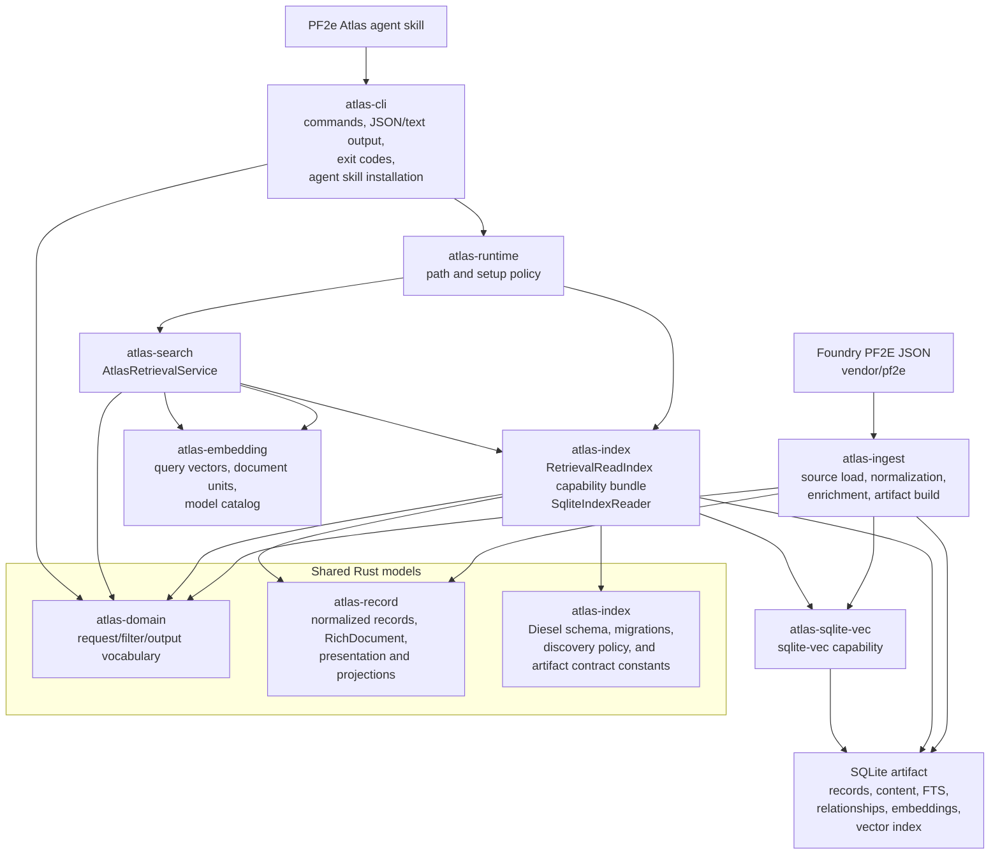
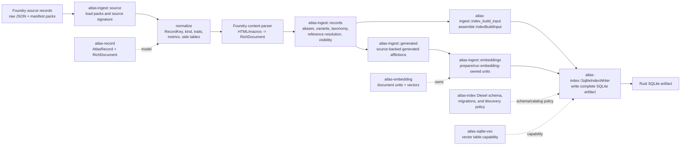
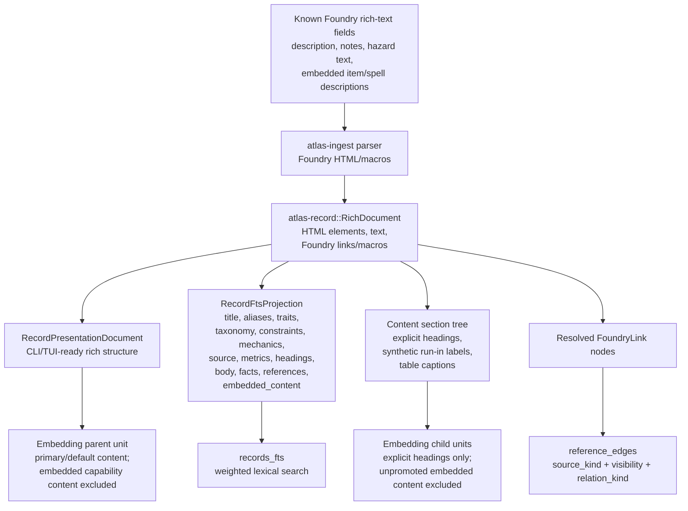

# Runtime Architecture

This document describes the Rust workspace architecture for deterministic ingest, artifact validation, local CLI workflows, lexical and semantic search, graph context retrieval, first-party agent skill workflows, and future Rust TUI/tagging surfaces.

The Rust architecture is deliberately crate-oriented. Crates should expose only the public API needed by adjacent owners, and ingest/build-time policy should not leak into runtime query or presentation crates.

## System Shape



## Crate Ownership

| Crate | Owns | Should not own |
| --- | --- | --- |
| `atlas-domain` | Shared request/filter/output vocabulary and lightweight semantic primitives, including the simple product filter DTO and canonical `SearchFilterNode` tree. | SQLite DDL, ingest source structs, artifact metadata inventories, CLI formatting, embedding provider config. |
| `atlas-record` | Storage-agnostic normalized records, typed metric definitions and labels, `RichDocument`, rich-content renderers, reference graph policy, reference traversal, section-tree projection, FTS projection, and `RecordPresentationDocument`. | Foundry HTML/macro parsing, SQLite names, validation diagnostics, CLI envelopes, embedding model execution. |
| `atlas-ingest` | Source loading, Foundry-specific parsing, normalization, Foundry metric source specs and metric extraction with definition validation, generated records, aliases/remaster links, reference resolution, retrieval visibility, embedding execution during builds, and owned conversion into `IndexBuildInput`. | Public embedding-specific API, runtime query orchestration, CLI presentation, broad crate-root behavior, metric-definition ownership, physical SQLite writer ownership. |
| `atlas-index` | Read-only completed-artifact access through narrow read capability traits and the composite `RetrievalReadIndex` bundle implemented by `SqliteIndexReader`, Diesel-backed relational schema and migrations, artifact writing through `IndexArtifactWriter` and `SqliteIndexWriter`, filter discovery field policy and SQLite extractor rendering, fast artifact readiness checks, deep artifact validation, row readers, internal filter-to-SQL keyset compilation, reference-policy SQL lowering, vector query SQL, and inspection summaries. | Query embedding, CLI command presentation, ingest-time normalization policy, runtime path policy, metric-definition ownership, shared discovery/result DTO vocabulary. |
| `atlas-embedding` | Model catalog, query/document embedding generation, token budgeting, embedding text rendering, document-unit construction, semantic input hashes, and embedding-specific public types. | Foundry raw markup parsing, artifact schema ownership, SQLite vector byte layout, search result collapse policy. |
| `atlas-search` | Product-facing retrieval orchestration through `AtlasRetrievalService` and narrow capability traits for records, text search, similar records, graph context, variants, remaster links, and filter discovery. It owns lexical/semantic composition, vector-hit collapse, and search ranking modes over read-only index handles. Semantic-only retrieval and low-level fusion controls are expert/debug APIs rather than ordinary product entrypoints. | Opening source files, building artifacts, loading models in CLI code, SQLite schema definitions, preflight artifact validation, or exposing index-owned SQL/read details as product API. |
| `atlas-runtime` | Repo/global path resolution, setup policy, setup readiness and repair orchestration, and construction of runtime index/retrieval handles shared by CLI and future Rust surfaces. | Search semantics, artifact schema, source normalization, CLI JSON projection, deep artifact diagnostics. |
| `atlas-cli` | Argument parsing, command routing, terminal/JSON presentation, progress output, exit codes, completions, and agent skill installation. | Durable retrieval semantics, SQLite access policy, embedding provider ownership. |
| `atlas-sqlite-vec` | Unsafe sqlite-vec extension registration and capability boundary. | Domain/search logic or artifact metadata interpretation. |

## Ingest And Artifact Flow



`atlas-ingest/src/lib.rs` is a thin facade. New ingest behavior belongs under the phase that owns it: `source`, `records`, `generated`, `embeddings`, or the build-input handoff. The final build-input handoff consumes ingest state into an owned `atlas-index::IndexBuildInput`; it should not be a borrowed view over `SourceLoad`. Physical SQLite artifact writing belongs in `atlas-index`.

Source normalization emits ingest-only construction facts beside each normalized record. These facts carry source identity such as slugs and compendium-source locators, embedded item identity/provenance/content references, and journal page content parsed from Foundry source JSON. Later ingest phases use those facts for aliases, remaster links, and source-backed generated records instead of reparsing `AtlasRecord.raw_json`; reference, FTS, and embedding projections consume the normalized `RichDocument` outputs produced during normalization. Persisted raw JSON remains provenance/debug input and a future analysis substrate, not the normal construction API between ingest phases.

## Content, Search, And Reference Projections



The durable source of authored rich text is `RichDocument`, not stripped text and not raw Foundry markup. `RichDocument` preserves HTML elements and Foundry enrichments together; plain text, structured presentation content for CLI JSON/terminal output, structured FTS rows, semantic chunks, and reference edges are projections from content and presentation models.

Default public graph and backlink behavior uses the named reference graph policy in `atlas-record`: public non-embedded reference edges are in the default graph, public embedded edges require an expanded mode, and GM/private/internal edges remain excluded unless a caller explicitly asks for broader visibility. `atlas-index` lowers that policy into SQL predicates over `reference_edges`; the database does not store a separate default-edge boolean.

## Runtime Query Flow

```mermaid
flowchart TD
    skill["PF2e Atlas agent skill"] --> command["atlas-cli command<br/>search, record, graph, index"]
    command --> runtime["atlas-runtime<br/>resolved paths + handles"]
    runtime --> search["atlas-search<br/>AtlasRetrievalService"]
    runtime --> index["atlas-index<br/>SqliteIndexReader"]
    search --> filters["atlas-index internal filter compiler<br/>SearchFilterNode -> eligible records"]
    filters --> sqlite["SQLite artifact"]

    search --> graph["atlas-index reference-edge queries<br/>default graph policy"]
    graph --> sqlite

    search --> lexical["atlas-index lexical SQL<br/>records_fts weighted columns"]
    lexical --> sqlite

    search --> queryVec["atlas-embedding<br/>query text -> vector"]
    queryVec --> vectorSql["atlas-index vector query<br/>eligible document_embedding_cache rowids"]
    vectorSql --> sqliteVec["atlas-sqlite-vec capability"]
    sqliteVec --> sqlite

    graph --> collapse["atlas-search result assembly"]
    lexical --> collapse
    vectorSql --> collapse
    collapse --> output["atlas-cli presentation<br/>JSON or terminal text"]
```

Simple product filters lower once through `atlas-domain::SimpleSearchFilter` into the canonical `SearchFilterNode` tree; advanced callers may provide a canonical tree directly. Filters compile to an authoritative SQL keyset before lexical or vector search. SQLite lexical search keeps that keyset in the same query as `records_fts` and the normal search path uses precision FTS lanes over title/alias and high-signal facet columns. `atlas-search` classifies FTS hits by title/alias coverage and high-value record-token coverage before hybrid fusion, so weak broad-token FTS evidence is demoted instead of crowding out stronger semantic matches. The vector table stays rowid plus vector; filtering metadata remains in normal SQLite tables and is reached through `document_embedding_cache.rowid`.

Product retrieval requests use shared page-number pagination through `atlas-search::SearchPage`, not caller-supplied SQL offsets. `atlas-search` translates that page intent into SQL limit/offset for filter-only listing and into bounded ranked result windows for text search, then returns `SearchPageInfo` so CLI, future TUI, and future web surfaces share one traversal contract.

Graph context retrieval is one-hop in the Rust CLI. `atlas graph links <record>` routes through `AtlasRetrievalService`, resolves a strict name when needed, loads the seed record through the normal record path, asks the `ReferenceReadIndex` boundary for policy-visible `reference_edges`, applies deterministic edge ordering and unique-neighbor limits, then hydrates only retained neighbor records. `atlas graph uses <record>` is the backlinks-focused form. `atlas similar <record>` is a record-to-record retrieval surface owned by `atlas-search`: runtime opens a vector-ready record retrieval service without loading the embedding model, resolves a seed record, loads the seed's stored parent embedding from the active SQLite index, queries vector candidates without re-rendering or re-embedding the seed, applies the same structured filter scope to candidates, and reranks/explains the result set with modest shared-reference and shared-trait evidence. Search relationship flags such as `--referenced-by` remain result-set filters; graph context retrieval returns a local context bundle with edge evidence, counts, and truncation metadata.

Runtime SQLite access is read-only and goes through `SqliteIndexReader`, with retrieval orchestration depending on index-owned read capability traits rather than on ad hoc SQL access. `atlas-index` owns the composite `RetrievalReadIndex` bundle for consumers that legitimately need the full retrieval read surface; `atlas-search` consumes that bundle while exposing product-facing retrieval traits to its own callers. Construction-time writes are separate and go through `IndexArtifactWriter` implementations such as `SqliteIndexWriter`, which write a temporary artifact and publish it only after records, FTS, embedding cache rows, and `record_vector_index` are complete. Product surfaces route retrieval and filter discovery through `atlas-runtime` and `AtlasRetrievalService`; they do not open SQLite or assemble retrieval dependencies directly. Callers should type dependencies to the narrow `atlas-search` capability trait they need, such as `RecordRetrieval`, `TextRetrieval`, `GraphRetrieval`, `VariantRetrieval`, `RemasterRetrieval`, or `FilterDiscoveryRetrieval`.

Record-reference inputs that intentionally accept either a canonical `RecordKey` or a strict resolvable record name use the `RecordRetrieval` record-reference resolver in `atlas-search`. Surface crates may decide which arguments accept that product behavior and how to present misses or ambiguity, but they should not duplicate the key-or-name resolution policy locally.

`atlas-runtime` owns path resolution for source checkouts, embedding model caches, and SQLite artifacts. The default `global` path mode resolves to platform cache install paths; `repo` requires checkout-local contributor paths. CLI path flags are command-local overrides passed into runtime resolution, not persisted configuration. Runtime path resolution failures are reported through typed `RuntimeError` / `RuntimeErrorKind` values so CLI, future TUI, and future web surfaces can distinguish repo-mode, current-directory, cache-root, and default-path failures without parsing messages. `--index` selects the SQLite artifact for commands that open or repair an artifact, while `atlas index build` uses `--output` for the artifact it writes. If persisted configuration is added later, it should feed runtime path overrides below direct CLI flags rather than changing the meaning of direct path flags.

## Artifact Families

The Rust SQLite artifact is the runtime contract between ingest and search. The authoritative table-family definitions live in [artifact contract](./artifact-contract.md). The current families are:

- artifact identity: `artifact_metadata`
- source packs: `packs`
- canonical records: `records`
- supplemental content: `record_content`
- aliases and remaster links: `record_aliases`, `remaster_links`
- filterable projections: `record_traits`, actor/item/spell side tables
- discovery catalogs: `filter_field_catalog`, `filter_value_catalog`, `filter_sample_catalog`, `filter_numeric_catalog`
- open metrics and catalogs: `record_metrics`, `metric_key_catalog`, `metric_value_catalog`
- reference graph: `reference_edges`
- lexical search: `records_fts`
- semantic cache and vector index: `document_embedding_cache`, `record_vector_index`

## Current Gaps And Deferred Shapes

- The future Ratatui workbench is a runtime consumer. It should compose through `atlas-search`, `atlas-index`, `atlas-runtime`, and `atlas-record` rather than opening SQLite or embedding models directly.
- Journal pages and table results are recognized as rich content but are deferred to [Rust content subdocuments for journal pages and table results](../backlog/items/rust-content-subdocuments-journal-table-results.md).
- Derived-tag rows are intentionally deferred until the Rust artifact model has a dedicated derived-tag design.
- Search quality tuning and broader full-corpus parity remain follow-up validation work, not reasons to reintroduce raw JSON scanning or duplicate markup parsing.
