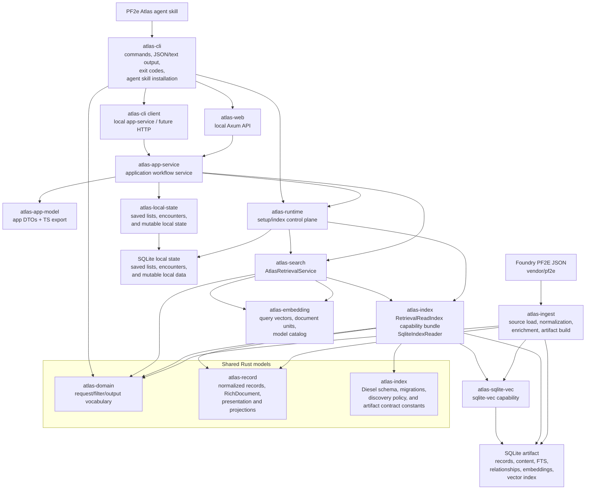
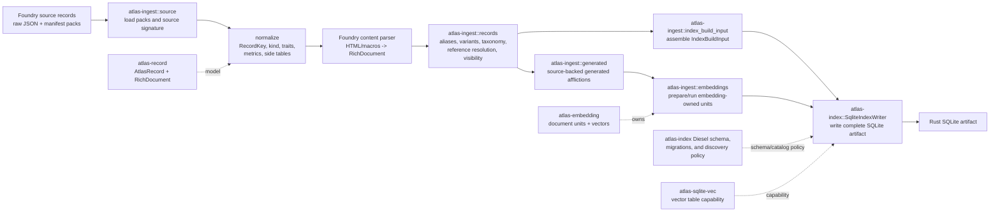
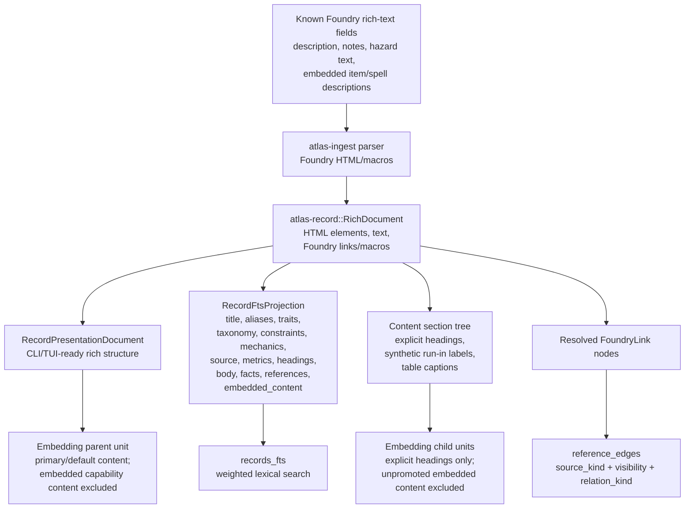

# Runtime Architecture

This document describes the Rust workspace architecture for deterministic ingest, artifact validation, local CLI workflows, local web workflows, lexical and semantic search, graph context retrieval, first-party agent skill workflows, and future Rust TUI/tagging surfaces.

The Rust architecture is deliberately crate-oriented. Crates should expose only the public API needed by adjacent owners, and ingest/build-time policy should not leak into runtime query or presentation crates.

## System Shape

```mermaid
flowchart TD
    source["Foundry PF2E JSON<br/>vendor/pf2e"] --> ingest["atlas-ingest<br/>source load, normalization,<br/>enrichment, artifact build"]
    ingest --> artifact["SQLite artifact<br/>records, content, FTS,<br/>relationships, embeddings,<br/>vector index"]
    localStateDb["SQLite local state<br/>saved lists, encounters,<br/>and mutable local data"]

    skill["PF2e Atlas agent skill"] --> cli["atlas-cli<br/>commands, JSON/text output,<br/>exit codes,<br/>agent skill installation"]
    cli --> web["atlas-web<br/>local Axum API"]
    web --> appService["atlas-app-service<br/>application workflow service"]
    appService --> appModel["atlas-app-model<br/>app DTOs + TS export"]
    appService --> runtime
    appService --> search
    appService --> localState["atlas-local-state<br/>saved lists, encounters,<br/>and mutable local state"]
    cli --> cliClient["atlas-cli client<br/>local app-service / future HTTP"]
    cliClient --> appService
    cli --> runtime["atlas-runtime<br/>setup/index control plane"]
    runtime --> search["atlas-search<br/>AtlasRetrievalService"]
    runtime --> index["atlas-index<br/>RetrievalReadIndex capability bundle<br/>SqliteIndexReader"]
    runtime --> localStateDb
    localState --> localStateDb

    search --> index
    search --> embedding["atlas-embedding<br/>query vectors, document units,<br/>model catalog"]
    index --> artifact
    ingest --> sqliteVec["atlas-sqlite-vec<br/>sqlite-vec capability"]
    index --> sqliteVec
    sqliteVec --> artifact

    subgraph SharedRustModels["Shared Rust models"]
      domain["atlas-domain<br/>request/filter/output vocabulary"]
      record["atlas-record<br/>normalized records, RichDocument,<br/>presentation and projections"]
      artifactSchema["atlas-index<br/>Diesel schema, migrations,<br/>discovery policy, and artifact contract constants"]
    end

    ingest --> domain
    ingest --> record
    index --> domain
    index --> record
    index --> artifactSchema
    search --> domain
    search --> embedding
    cli --> domain
```

## Crate Ownership

| Crate | Owns | Should not own |
| --- | --- | --- |
| `atlas-app-model` | Interactive app workflow DTOs, app errors, readiness views, filter editor contracts, basic filter state, result-window request/response types, record view wrappers, serde contracts, and generated TypeScript app contracts. | Durable search semantics, SQLite access, runtime path policy, CLI presentation, or duplicate record presentation/rich document logic. |
| `atlas-app-service` | Application workflow orchestration over `atlas-runtime`, `atlas-search`, and `atlas-local-state`, including web full retrieval-service startup, explicit on-demand retrieval modes for short-lived local CLI clients, result-window metadata, filter editor projection, app filter lowering, record detail projection, saved-list read projection/hydration, encounter runner projection/hydration, and app error mapping. Its service entry module owns the public handle, shared state, local-state path, and bounded retrieval executor; workflow modules own result-window, record-detail, filter-discovery, saved-list, and encounter orchestration plus their focused tests. | Direct `atlas-index` access, SQLite reader assembly, implicit retrieval fallback policy, HTTP routing, frontend layout/state, or a single unbounded global request lane. |
| `atlas-web` | Local Axum HTTP routes, API error/status mapping, and future static frontend serving for the local web app. | Retrieval semantics, result-window policy, app DTO definitions, SQLite access, frontend component logic. |
| `atlas-domain` | Shared request/filter/output vocabulary and lightweight semantic primitives, including the simple product filter DTO and canonical `SearchFilterNode` tree. | SQLite DDL, ingest source structs, artifact metadata inventories, CLI formatting, embedding provider config. |
| `atlas-tags` | Tag ontology, YAML parsing, corpus loading, applicability evaluation, assignment validation, evidence validation, ontology suggestions, and tagging agent contract DTOs. | Raw source normalization, SQLite schema, runtime path policy, CLI presentation, or terminal rendering. |
| `atlas-local-state` | Durable mutable local state stored outside the generated artifact, including saved-list schema/items and encounter schema/participants with snapshots for unresolved record-backed rows. | Generated artifact schema, source ingest, retrieval/search semantics, runtime path policy, CLI presentation, or frontend state. |
| `atlas-record` | Storage-agnostic canonical records/entities, contextual occurrences, typed metric definitions and labels, mechanics/activity targets, `RichDocument`, rich-content renderers, reference graph policy, reference traversal, section-tree projection, FTS projection, presentation profiles, and the existing CLI `RecordJson` projection. | Foundry HTML/macro parsing, SQLite names, validation diagnostics, top-level CLI envelopes, app DTOs, embedding model execution. |
| `atlas-ingest` | Source loading, the versioned serialized PF2e Source boundary, exhaustive coverage declarations, Foundry-specific parsing, canonical normalization, metric/side projections from shared facts, generated records, aliases/remaster links, reference resolution, retrieval disposition, embedding execution during builds, and owned conversion into `IndexBuildInput`. | Prepared Foundry Data as a contract, runtime raw-JSON fallback, public embedding-specific API, runtime query orchestration, CLI presentation, broad crate-root behavior, metric-definition ownership, physical SQLite writer ownership. |
| `atlas-index` | Read-only completed-artifact access through narrow read capability traits and the composite `RetrievalReadIndex` bundle implemented by `SqliteIndexReader`, Diesel-backed relational schema and migrations, artifact writing through `IndexArtifactWriter` and `SqliteIndexWriter`, filter discovery field policy and SQLite extractor rendering, fast artifact readiness checks, deep artifact validation, row readers, internal filter-to-SQL keyset compilation, reference-policy SQL lowering, vector query SQL, and inspection summaries. | Query embedding, CLI command presentation, ingest-time normalization policy, runtime path policy, metric-definition ownership, shared discovery/result DTO vocabulary. |
| `atlas-embedding` | Model catalog, query/document embedding generation, token budgeting, embedding text rendering, document-unit construction, semantic input hashes, and embedding-specific public types. | Foundry raw markup parsing, artifact schema ownership, SQLite vector byte layout, search result collapse policy. |
| `atlas-search` | Product-facing retrieval orchestration through `AtlasRetrievalService` and narrow capability traits for records, text search, similar records, graph context, variants, remaster links, and filter discovery. It owns lexical/semantic composition, vector-hit collapse, search ranking modes, and product-shaped filter discovery intent over read-only index handles. Semantic-only retrieval and low-level fusion controls are expert/debug APIs rather than ordinary product entrypoints. | Opening source files, building artifacts, loading models in CLI code, SQLite schema definitions, preflight artifact validation, or exposing index-owned SQL/read details as product API. |
| `atlas-runtime` | Repo/global path resolution, setup policy, setup readiness and repair orchestration, and construction of runtime index/retrieval handles shared by CLI and future Rust surfaces. | Search semantics, artifact schema, source normalization, CLI JSON projection, deep artifact diagnostics. |
| `atlas-cli` | Argument parsing, command routing, terminal/JSON presentation, progress output, exit codes, completions, and agent skill installation. | Durable retrieval semantics, SQLite access policy, embedding provider ownership. |
| `atlas-sqlite-vec` | Unsafe sqlite-vec extension registration and capability boundary. | Domain/search logic or artifact metadata interpretation. |

## Checkpoint B Source-Faithful Contract

ADRs 0033-0036 define the Checkpoint B-approved implementation target. Work proceeds through the named dependency-ordered owners; approval of the contract does not collapse those slice boundaries.

Canonical entities own intrinsic facts. Occurrences own parent/owner context, authored order, contextual labels/overrides, and stable repeated-use identity. Runtime instances own mutable local state. `search_compact`, `record_detail`, and `encounter_participant` are app-service projections of those shared semantics.

The exhaustive registry covers every discovered document/type/role/parent-context tuple, including registration-only and provenance-only entries. Discovery and assignment never filter by visibility. Atlas currently has no authentication boundary, but the pinned base is not GM-complete: ordinary retrieval still inherits default-visible/public-only predicates. Checkpoint A's target makes useful authored information available regardless of typed visibility classification. Visibility, role, source kind, and provenance remain typed inputs for meaning and a future separately approved auth feature; they make no current security claim. Retained target exclusions require explicit non-auth product rationale and audit evidence.

## Ingest And Artifact Flow

```mermaid
flowchart LR
    raw["Foundry source records<br/>raw JSON + manifest packs"] --> load["atlas-ingest::source<br/>load packs and source signature"]
    load --> normalize["normalize<br/>RecordKey, kind, traits,<br/>metrics, side tables"]
    normalize --> content["Foundry content parser<br/>HTML/macros -> RichDocument"]
    content --> enrich["atlas-ingest::records<br/>aliases, variants, taxonomy,<br/>reference resolution, visibility"]
    enrich --> generated["atlas-ingest::generated<br/>source-backed generated afflictions"]
    generated --> embedPrep["atlas-ingest::embeddings<br/>prepare/run embedding-owned units"]
    enrich --> buildInput["atlas-ingest::index_build_input<br/>assemble IndexBuildInput"]
    buildInput --> writer["atlas-index::SqliteIndexWriter<br/>write complete SQLite artifact"]
    embedPrep --> writer
    writer --> sqlite["Rust SQLite artifact"]

    record["atlas-record<br/>AtlasRecord + RichDocument"] -. model .-> normalize
    artifactSchema["atlas-index Diesel schema,<br/>migrations, and discovery policy"] -. schema/catalog policy .-> writer
    embedding["atlas-embedding<br/>document units + vectors"] -. owns .-> embedPrep
    sqliteVec["atlas-sqlite-vec<br/>vector table capability"] -. capability .-> writer
```

`atlas-ingest/src/lib.rs` is a thin facade. New ingest behavior belongs under the phase that owns it: `source`, `records`, `generated`, `embeddings`, or the build-input handoff. The final build-input handoff consumes ingest state into an owned `atlas-index::IndexBuildInput`; it should not be a borrowed view over `SourceLoad`. Physical SQLite artifact writing belongs in `atlas-index`.

Candidate validation may retain one private in-process `SourceLoad` long enough to
derive source analysis, the strict source audit, canonical-closure assertions, and
the two validation artifact modes. A checksum-bound snapshot records identity,
reports, timings, and a complete semantic digest of the captured build input for
review; it cannot deserialize back into `SourceLoad` or `IndexBuildInput` and is
not available to runtime, setup, search, API, or UI code. Candidate/source or
policy/schema/toolchain/embedding identity changes invalidate it rather than
falling back to stale evidence.

Artifact-mode validation similarly retains one private live handle over one
manifest-verified immutable generation and one `SqliteIndexReader`. The handle
binds the candidate/snapshot tuple, canonical file/generation identity, size,
trusted digest, and artifact/source/embedding metadata. Its existing Diesel and
rusqlite connections serve round-trip hydration and one deep-coherence pass;
inspection and serialized evidence consume the resulting in-memory receipt
without another reader, pathname reopen, full validation scan, digest pass, or
generation copy. The handle and receipt are validation-process capabilities, not
runtime inputs, caches, product models, or artifact contracts.

Validation resolves requested embedding selectors through the existing
`EmbeddingModelId` catalog before source traversal and binds receipts to the
typed model plus its canonical provider ID. Artifact metadata remains a
post-publication check. Every later validation exit atomically retains typed
failure and partial-timing evidence, carrying forward trusted visible/generation
digests for checksum closure instead of rereading artifact bytes. This is private
validation plumbing only and does not alter model selection or artifact metadata.

The strict audit preserves its accepted pre-localization observation contract by
normalizing each already captured raw source record for audit only; it does not
reread the corpus and does not alter the localized `SourceLoad` used by canonical
product and artifact construction. Its complete detailed report is atomically
written and checksum-bound before enforcement returns either PASS or FAIL, so a
failed snapshot retains exact identity, value/type/state, multiplicity/order,
enforcement, and closure evidence.

Source-field promotion follows [ADR 0032](./decisions/0032-ingest-product-intent.md), while exhaustive classification follows proposed [ADR 0033](./decisions/0033-source-fidelity-and-exhaustive-coverage.md): ingest should model Foundry source facts when they improve search/discovery, record presentation, runtime play surfaces, CLI/agent workflows, graph/reference behavior, or audit/data-quality feedback. Every meaningful path still receives an owner/disposition even when it is not promoted. Do not mirror raw JSON into typed models solely because a field exists.

The serialized-source boundary is versioned as `pf2e-serialized-source/v1` and is pinned to PF2e system `6.12.4` at upstream commit `4cbdaa37d6c33e9519561bae2c59a23e0288cbce`. `atlas-ingest::source::dto` dispatches the complete closed Actor and Item discriminator vocabularies, exposes the approved NPC core and full embedded-Item envelopes, validates exact NPC-to-Item parent contexts, and preserves `Missing | Null | Value` without applying Foundry defaults. Shape and discriminator failures carry the record key, source path, JSON path, expected shape, actual shape, and source-version metadata. The full serialized tree remains inside the source boundary for later typed promotion, while the original `serde_json::Value` has only an explicitly named provenance/audit accessor. The boundary is the sole serialized-source adapter; canonical conversion consumes its typed fields and never queries the retained tree as a semantic fallback.

Source snapshot identity is captured at the raw read boundary, before parsing or canonical/DTO/enrichment projection can reject a record. `atlas-source-signature-v1` signs stable relative manifest, localization, pack, and raw record path/content inputs; projection outcomes and diagnostic `Display` text are not signature inputs. A projection failure therefore remains reportable without changing the identity of unchanged source bytes, and moving identical source inputs to another root leaves the signature unchanged.

`atlas-record::CreatureRecord` is the durable storage-neutral creature-family subtype. Its B3 core owns typed source-presence and provenance for identity/classification, source adjustment and alliance, legacy ability facts, perception and source initiative selection, languages, standard and Lore skills, defenses and IWR, movement, and resources. Its embedded-entity contract owns typed strikes, actions, spellcasting entries, spells, equipment, and Lore capabilities plus typed shells for every other valid NPC child. Occurrences retain explicit source sort and authored order, parent entry and prepared slot, rank/location/use/group/label context, source locators, and source-state deltas independently of canonical targets. Actor spellcasting context retains ritual DC without executing casting behavior. Exact verified source locators may resolve to an existing `RecordKey`; unresolved or absent locators create typed actor-owned entities, and a missing nested source ID uses a diagnosed unstable owner/family/ordinal occurrence identity. Grant, item-grant, prepared-spell, and linked-weapon relationships retain nested IDs and lifecycle provenance but have no execution semantics. Closed vocabularies use enums; provider-defined slugs use validated newtypes; ambiguous legacy shapes remain explicit unsupported values with conversion diagnostics. Individual embedded scalar type drift is field-local: the complete Source envelope, parent, valid sibling entities, and occurrences survive, while a reusable typed-or-unsupported scalar retains the exact JSON value without coercion. Stable source-backed component IDs and authored collection order are stored separately. When a valid open source value cannot be used directly as a component ID, ingest preserves the value and derives a reversible record-scoped source fallback; absent or null component identity uses the existing diagnosed owner/family/ordinal fallback. Neither case discards the enclosing record. Diagnostics use stable codes plus relative record/source/field identity, expected and observed shape, exact source value, disposition, and owner rather than absolute paths or formatted errors. Source alliance is intrinsic only and never selects encounter side. Serialized shield HP and resource values are provenance-only, and legacy resource `maxx` remains typed unsupported drift. This remains one creature subtype rather than a parallel creature, Spell, or Item truth.

`atlas-record::project_creature_facts` is the single pre-artifact projection for migrated creature metric rows and categorical actor side facts. Perception, AC, HP, saves, standard and Lore skills, movement values, sense ranges, size, languages, movement modes, senses, and IWR categories derive from `CreatureRecord`; presentation and FTS consume those same projected rows and categories. Missing and null canonical values produce no scalar row, numeric zero remains a metric value, and unsupported numeric shapes remain diagnosed canonical facts rather than coerced metrics. Ingest raw source specs remain only for facts not represented by the current creature contract, such as ability/rank, hardness/broken-threshold/stealth, hazard disable, and non-NPC Actor families.

Source normalization emits ingest construction facts beside each normalized record. These facts retain the complete versioned NPC Source envelope and carry the canonical creature body into the atomic artifact writer, source identity such as slugs and compendium-source locators, embedded item identity/provenance/content references, and journal page content parsed from Foundry source JSON. The typed envelope preserves valid sibling fields and the immutable provenance/audit payload without becoming a raw semantic fallback. Sparse actor rows and metric rows are one-way projections from `CreatureRecord`, not a second parser, canonical store, or hydration fallback. Later ingest phases use construction facts for aliases, remaster links, and source-backed generated records instead of reparsing `AtlasRecord.raw_json`; reference, FTS, and embedding projections consume the normalized `RichDocument` outputs produced during normalization. Persisted raw JSON remains provenance/debug input and a future analysis substrate, not the normal construction API between ingest phases.

`atlas index audit-source-paths` is the explicit offline diagnostic for that analysis substrate. It scans Foundry source packs, inventories meaningful scalar JSON paths with representative examples, validates NPC and Item envelopes through the B1 typed DTO boundary, and resolves paths against versioned real-owner declarations. Empty scaffolding does not create warnings; zero and false remain meaningful. Dynamic maps normalize to stable wildcard families, diagnostics and JSON are deterministically sorted, and the report distinguishes consumed, ignored-with-rationale, provenance-only, exact-owner deferred, unknown, and typed source drift. Relaxed mode aggregates warnings; `--strict` fails CI/source-refresh validation on unknowns or typed drift, and `--baseline` adds reviewed vendored-source added/removed/reclassified path enforcement. The creature ledger additionally fails strict mode on any deferred, catch-all, unowned, unknown, or consumed-regression path; the closed creature contract permits only exact consumed or explicit provenance-only leaves. This command may inspect broad raw source JSON because it is reporting/debug tooling; runtime lookup, search, filtering, and presentation still use typed records, side tables, content documents, and product DTOs.

## Content, Search, And Reference Projections

```mermaid
flowchart TD
    markup["Known Foundry rich-text fields<br/>description, notes, hazard text,<br/>embedded item/spell descriptions"] --> parser["atlas-ingest parser<br/>Foundry HTML/macros"]
    parser --> doc["atlas-record::RichDocument<br/>HTML elements, text,<br/>Foundry links/macros"]

    doc --> presentation["RecordPresentationDocument<br/>CLI/TUI-ready rich structure"]
    doc --> fts["RecordFtsProjection<br/>title, aliases, traits,<br/>taxonomy, constraints, mechanics,<br/>source, metrics, headings,<br/>body, facts, references,<br/>embedded_content"]
    doc --> tree["Content section tree<br/>explicit headings,<br/>synthetic run-in labels,<br/>table captions"]
    doc --> refs["Resolved FoundryLink nodes"]

    presentation --> parentEmbedding["Embedding parent unit<br/>primary/default content;<br/>embedded capability content excluded"]
    tree --> childEmbedding["Embedding child units<br/>explicit headings only;<br/>unpromoted embedded content excluded"]
    refs --> edges["reference_edges<br/>source_kind + visibility + relation_kind"]
    fts --> recordsFts["records_fts<br/>weighted lexical search"]
```

The durable source of authored rich text is `RichDocument`, not stripped text and not raw Foundry markup. `RichDocument` preserves HTML elements and Foundry enrichments together; plain text, structured presentation content for CLI `RecordJson`/terminal output, structured FTS rows, semantic chunks, references, app DTOs, and UI blocks are projections. Content attaches to typed record/entity/subdocument owners and retains stable content, section, and occurrence targets.

For the creature slice, `CreatureRecord.content` is the canonical owned-content collection.
Ingest assigns stable source keys independently from `content_hash` and the later
`semantic_input_hash`, attaches actor lore and notes to the record, attaches unresolved
actor-owned capability prose to that entity, and attaches copied or locally overridden canonical
spell/item prose to the B4 occurrence. Embedded `system.description.gm` fields attach to that same
typed entity or occurrence owner with a stable `gm-description` key, embedded GM source kind,
`gm_only` visibility, authored order, and exact source provenance, including children whose
intrinsic standalone model remains assigned to a later family. Visibility is retained
classification data; this slice neither authenticates nor hides content. Copied canonical prose is
typed as such for later ranking policy; B5 does not create a second spell/item truth or implement
search weighting. Every parsed reference produces an ordered typed occurrence carrying the same
owner, role, origin, visibility, and provenance as its source content document. Unsupported
meaningful tags/attributes, unknown Foundry macros, unstable fallback identities, and unresolved
links remain safe content plus typed diagnostics.

Foundry markup has one parser owner under `atlas-ingest::source::normalize::content`. Ingest
consumers, including remaster-journal alias/reference extraction, traverse the resulting
`RichDocument`; they do not retain and reparse source markup. Schema v2 persists the complete
owned-content collection and `atlas-index::read` hydrates it from the canonical body. The legacy
`AtlasRecord.content` value remains a one-way record-owned projection for consumers that request
the older narrow record DTO; it is not a second canonical hydration path.

Generated-affliction construction uses an explicit `canonical | source_instance` role and three typed host-instance-canonical relationships. Canonicals own deduplicated user-facing meaning; source instances preserve exact host occurrence/provenance. The role is construction-time duplicate-control and provenance metadata, not an authorization or visibility classification. Schema v2 persists and validates that role plus its explicit duplicate-control retrieval disposition; D1 owns later retrieval adaptation, and D3 audits the one-canonical/one-instance/three-relationship fixture before UI work.

Pinned-base graph and backlink behavior is not GM-complete: default and public-with-embedded modes require `ContentVisibility::Public`, default backlinks omit GM/private and copied embedded capability sources, and variant expansion uses `is_default_visible`. The approved target keeps typed source kind, visibility, role, provenance, and relation kind while removing classification-only suppression. Copied embedded capability edges may remain outside the default mode to avoid duplicate/noisy results while staying available through an expanded capability mode, implementation-only provenance may remain inspection-only because it has no authored product meaning, and legacy variants may be demoted from ordinary ranking to avoid duplicate remaster results while staying directly addressable. `atlas-record` owns the named target graph policy and `atlas-index` lowers it into SQL predicates; neither may invent an authorization boundary.

## Runtime Query Flow

```mermaid
flowchart TD
    skill["PF2e Atlas agent skill"] --> command["atlas-cli product read command<br/>search, record, graph, lists, filters"]
    skill --> control["atlas-cli control command<br/>setup, index"]
    command --> cliClient["atlas-cli client<br/>local app-service"]
    cliClient --> appService["atlas-app-service"]
    appService --> runtime["atlas-runtime<br/>resolved paths + handles"]
    appService --> search["atlas-search<br/>AtlasRetrievalService"]
    control --> runtime
    runtime --> index["atlas-index<br/>SqliteIndexReader"]
    search --> filters["atlas-index internal filter compiler<br/>SearchFilterNode -> eligible records"]
    filters --> sqlite["SQLite artifact"]

    search --> graph["atlas-index reference-edge queries<br/>default graph policy"]
    graph --> sqlite

    search --> lexical["atlas-index lexical SQL<br/>records_fts weighted columns"]
    lexical --> sqlite

    search --> queryVec["atlas-embedding<br/>query text -> vector"]
    queryVec --> vectorSql["atlas-index vector query<br/>eligible document_embedding_cache rowids"]
    vectorSql --> sqliteVec["atlas-sqlite-vec capability"]
    sqliteVec --> sqlite

    graph --> collapse["atlas-search result assembly"]
    lexical --> collapse
    vectorSql --> collapse
    collapse --> output["atlas-cli presentation<br/>JSON or terminal text"]
```

Simple product filters lower once through `atlas-domain::SimpleSearchFilter` into the canonical `SearchFilterNode` tree; advanced callers may provide a canonical tree directly. Filters compile to an authoritative SQL keyset before lexical or vector search. SQLite lexical search keeps that keyset in the same query as `records_fts` and the normal search path uses precision FTS lanes over title/alias and high-signal facet columns. `atlas-search` classifies FTS hits by title/alias coverage and high-value record-token coverage before hybrid fusion, so weak broad-token FTS evidence is demoted instead of crowding out stronger semantic matches. The vector table stays rowid plus vector; filtering metadata remains in normal SQLite tables and is reached through `document_embedding_cache.rowid`.

Product retrieval requests use shared page-number pagination through `atlas-search::SearchPage`, not caller-supplied SQL offsets. `atlas-search` translates that page intent into SQL limit/offset for filter-only listing and into bounded ranked result windows for text search, then returns `SearchPageInfo` so CLI, future TUI, and future web surfaces share one traversal contract. Stateful surfaces that need to filter a caller-owned record set, such as saved-list views, pass a generic `RecordScope` to `atlas-search` for listing, discovery, and text search; `atlas-index` applies that scope as an intersection with the compiled SQL keyset rather than teaching search about the stateful product.

Graph context retrieval is one-hop. `atlas graph links <record>` routes through the CLI client into app-service and `AtlasRetrievalService`, resolves a strict name when needed, loads the seed record through the normal record path, asks the `ReferenceReadIndex` boundary for policy-visible `reference_edges`, applies deterministic edge ordering and unique-neighbor limits, then hydrates only retained neighbor records. `atlas graph uses <record>` is the backlinks-focused form. Variant group resolution is owned by `atlas-search`: canonical record keys open the group for that concrete record, while text inputs prefer direct variant base-name group lookup before strict record-name fallback. `atlas similar <record>` is a record-to-record retrieval surface owned by `atlas-search`: runtime opens a vector-ready record retrieval service without loading the embedding model, resolves a seed record, loads the seed's stored parent embedding from the active SQLite index, queries vector candidates without re-rendering or re-embedding the seed, applies the same structured filter scope to candidate retrieval, and reranks/explains the result set with modest shared-reference and shared-trait evidence. The ref-based similar surface resolves strict seed names with that same structured filter so inputs like `atlas similar "Dirge of Doom" --kind spell` choose the spell seed, while the direct key-based similar request remains available for callers that already have a canonical `RecordKey`. Search relationship flags such as `--referenced-by` remain result-set filters; graph context retrieval returns a local context bundle with edge evidence, counts, and truncation metadata.

Runtime SQLite access is read-only and goes through `SqliteIndexReader`, with complete canonical record hydration owned only by `atlas-index::read`. The reader requires a body for every v2 NPC, rejects bodies attached to non-NPC rows, verifies the canonical body's exact resource/entity/occurrence/relationship/content/reference/exclusion/metric projections before returning hydrated records, and requires the adjacent manifest before opening the database. Pair acquisition takes the target's shared publication lock, verifies the manifest digest against one open visible SQLite file, materializes or verifies the digest-named immutable generation snapshot, and opens every retained Diesel and validation/hydration connection on that snapshot before releasing the lock. No validation, readiness, inspection, or hydration operation reopens the visible artifact pathname. Long-lived readers stay on their verified generation while a publisher installs a new pair, and later readers bind to the new generation. Retrieval orchestration depends on index-owned read capabilities rather than ad hoc SQL; search may request an explicit narrow read trait but must not create a second canonical hydration path. `atlas-index` owns the composite `RetrievalReadIndex` bundle for consumers that legitimately need the full retrieval read surface; `atlas-search` consumes that bundle while exposing product-facing retrieval traits to its own callers. Construction-time writes are separate and go through `IndexArtifactWriter` implementations such as `SqliteIndexWriter`, which write a temporary artifact only after canonical records/entities/occurrences/relationships/content, projections, embedding cache rows, and `record_vector_index` are complete. Ingest then stages the adjacent digest-bound manifest and invokes the index-owned pair publisher. The publisher uses a bounded exclusive-lock acquisition, verifies the staged pair before changing visible paths, preserves the prior matching pair in fixed recovery backups, and restores or recovers that pair after publication failure or interruption. Product surfaces route retrieval and filter discovery through the CLI client/app-service boundary, `atlas-runtime`, and `AtlasRetrievalService`; they do not open SQLite or assemble retrieval dependencies directly.

The local web surface follows the same boundary through `atlas-app-service`. `atlas web` resolves path overrides and starts Axum; `atlas-web` serves the embedded built frontend plus `/api/*` routes, but app-service retrieval workers open full `AtlasRetrievalService` instances with `AtlasRuntime::open_retrieval_service`. Web startup fails if the full semantic-search runtime is not ready. App-service also supports an explicit on-demand no-embeddings retrieval mode for short-lived local CLI workflows; `atlas web` must continue to use the full pooled mode. Axum handlers call the cloneable app-service handle, and the app service owns result-window metadata plus a bounded retrieval executor so read-only requests from multiple clients do not serialize behind one global database lane. Queue saturation is reported as a retryable service-busy app error rather than growing an unbounded backlog. Saved-list and encounter reads and mutations are app-service workflows: app-service opens the runtime-resolved local-state database, composes product APIs from `atlas-local-state` with record resolution and hydration from `atlas-search`, and marks unresolved rows explicitly.

Filter discovery callers express product intent through `atlas-search` request types. `atlas-search` owns option coherence such as metric selector shape before adapting to index read requests. `atlas-index` still owns catalog-backed and dynamic discovery execution, including SQL, field definitions, metric resolution against catalog rows, and artifact-specific error details.

The local web filter editor is an app-layer projection over product discovery, not a frontend-owned field catalog. `atlas-app-service` adapts `atlas-search` discovery into `FilterEditorView`, including app field ids, groups, typed controls, placement, labels, supported operators, count support, metric comparison controls, field applicability, selected-field preservation, and display ordering such as rarity domain order. `web/atlas-ui` renders that contract and may keep local visibility, pending input values, URL state, and component rendering state, but it should not hard-code product filter groupings, control kind, fallback value lists, field label policy, or discovery-scope semantics. Actual frontend filter values should be stored as app-model `FilterClause` entries so visible controls, URL state, search execution, and discovery context share one clause-first representation.

Interactive filter discovery uses different scopes for different product questions:

- Editor field applicability is result-space-aware. The backend may use the current filter set to decide which unselected fields are useful in the current result space; this is not limited to record kind. Single-kind filters may use catalog-backed counts as an optimization, but kind is not a special semantic rule.
- Selected fields must remain editable even when the current result space would otherwise make that field non-applicable or zero-count. The app-service projection should preserve selected controls and mark their applicability/status instead of allowing the frontend to lose the control needed to revise or remove the clause.
- Field value discovery is self-excluding for the field being edited. Counts and options for a field are computed with the active filter minus clauses for that same field, so users can build unions such as multiple kinds or rarities while still narrowing unrelated fields like publication or metrics by the rest of the active filter.
- Result retrieval uses the full active filter. Filter-editor discovery scopes must not change the search result semantics.

This scoping policy belongs in `atlas-app-service` and app-model DTOs, not in `web/atlas-ui`. The frontend should pass the current app filter context and the field being edited; app-service should derive the discovery filter used for editor structure and value options before lowering to `atlas-search`. For saved-list discovery, app-service resolves the list ref through local-state and passes the active record keys as a `RecordScope`; unresolved local-state rows remain preserved in local-state but are outside scoped filter/discovery counts. `atlas-search` and `atlas-index` remain responsible for product discovery execution, metric selector coherence, dynamic/catalog discovery, and SQL-backed applicability/counts.

Record-reference inputs that intentionally accept either a canonical `RecordKey` or a strict resolvable record name use the `RecordRetrieval` record-reference resolver in `atlas-search`. Surface crates may decide which arguments accept that product behavior and how to present misses or ambiguity, but they should not duplicate the key-or-name resolution policy locally.

`atlas-runtime` owns path resolution for source checkouts, embedding model caches, SQLite artifacts, and the local-state database. The default `global` path mode resolves to platform cache install paths; `repo` requires checkout-local contributor paths. CLI path flags are command-local overrides passed into runtime resolution, not persisted configuration. Runtime path resolution failures are reported through typed `RuntimeError` / `RuntimeErrorKind` values so CLI, future TUI, and future web surfaces can distinguish repo-mode, current-directory, cache-root, and default-path failures without parsing messages. `--index` selects the SQLite artifact for commands that open or repair an artifact, while `atlas index build` uses `--output` for the artifact it writes. The local-state database resolves beside the active artifact as `pf2e-local-state.sqlite`; v1 intentionally has no direct local-state path override. If persisted configuration is added later, it should feed runtime path overrides below direct CLI flags rather than changing the meaning of direct path flags.

Durable mutable state does not live in the generated artifact. `atlas-local-state` owns local-state schema and product APIs for saved lists, encounters, and future mutable product surfaces. `atlas-runtime` only resolves the local-state database path beside the active artifact; it does not own saved-list or encounter behavior. Saved lists have stable generated `list_key` identity plus a separate unique slug for URL, CLI, and script-friendly references. Saved-list tags are user-authored local-state metadata used for grouping and filtering lists in product surfaces; they are not generated artifact taxonomy rows. Encounters follow the same identity shape with a stable generated `encounter_key` plus a unique slug, while participants use separate `participant_key` instance identity so duplicate creatures or hazards remain independent rows. Local-state resolves list and encounter refs by key or slug, so browser routes and CLI commands can remain slug-oriented while update workflows can use stable keys internally when changing a slug. Saved-list item additions and record-backed encounter participant additions must resolve to one active canonical `RecordKey`; local-state accepts already-resolved inputs and stores canonical keys plus snapshots. App-service owns workflows that resolve record refs, call local-state, hydrate active artifact records, and preserve unresolved rows explicitly after artifact rebuilds.

## Artifact Families

The Rust SQLite artifact is the runtime contract between ingest and search. The authoritative table-family definitions live in [artifact contract](./artifact-contract.md). The current families are:

- artifact identity: `artifact_metadata`
- source packs: `packs`
- canonical records: `records`
- authored content: `record_content`
- aliases and remaster links: `record_aliases`, `remaster_links`
- filterable projections: `record_traits`, actor/item/spell side tables; future `record_tags`
- discovery catalogs: `filter_field_catalog`, `filter_value_catalog`, `filter_sample_catalog`, `filter_numeric_catalog`
- open metrics and catalogs: `record_metrics`, `metric_key_catalog`, `metric_value_catalog`
- reference graph: `reference_edges`
- lexical search: `records_fts`
- semantic cache and vector index: `document_embedding_cache`, `record_vector_index`

## Current Gaps And Deferred Shapes

- The future Ratatui workbench is an interactive app consumer. It should compose through `atlas-app-model` and `atlas-app-service` rather than opening SQLite or embedding models directly.
- Journal pages and table results are recognized as addressable child rich content. Their exact family implementation remains assigned to the H8 journals/tables planning portfolio and [Rust content subdocuments for journal pages and table results](../backlog/items/rust-content-subdocuments-journal-table-results.md); they must retain identity, order, typed visibility/provenance, and parent context rather than flattening into parent prose.
- Child embeddings remain overflow-only. Broader body/structured child indexing is deferred to [Rust RichDocument child retrieval policy](../backlog/items/rust-rich-document-child-retrieval-policy.md) and requires a separate measured approval.
- Tag rows are intentionally deferred until the accepted [tagging architecture](./tagging.md) is implemented. The target runtime table family is `record_tags`, written during regular `atlas index build` from validated YAML catalog and assignment files.
- Search quality tuning and broader full-corpus parity remain follow-up validation work, not reasons to reintroduce raw JSON scanning or duplicate markup parsing.
