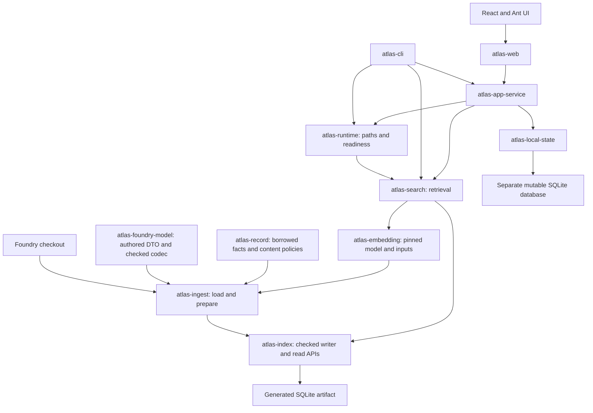

# Runtime architecture

Runtime reads use a source-backed generated artifact. Build-time admission,
filesystem discovery and developer reports remain separate from product retrieval.
See the [overview](./overview.md) for crate ownership and the
[artifact contract](./artifact-contract.md) for storage/validation.

```mermaid
flowchart TD
    source[Foundry checkout] --> ingest[atlas-ingest: load and prepare]
    model[atlas-foundry-model: authored DTO and checked codec] --> ingest
    record[atlas-record: borrowed facts and content policies] --> ingest
    embedding[atlas-embedding: pinned model and inputs] --> ingest
    ingest --> index[atlas-index: checked writer and read APIs]
    index --> artifact[Generated SQLite artifact]
    runtime[atlas-runtime: paths and readiness] --> search[atlas-search: retrieval]
    search --> index
    search --> embedding
    cli[atlas-cli] --> runtime
    cli --> search
    cli --> app[atlas-app-service]
    web[atlas-web] --> app
    app --> runtime
    app --> search
    app --> local[atlas-local-state]
    local --> state[Separate mutable SQLite database]
    browser[React and Ant UI] --> web
```

## Source loading and checked records

Private TypeScript tooling resolves pinned Foundry declarations and emits modular
Rust under `atlas-foundry-model/src/source_model/generated`. Large extracted
graphs are ignored caches; CI regenerates/checks committed Rust. Ordinary builds
need neither Node nor the upstream checkout. Generation ownership, recursive
identity, templates and authored profiles follow ADR0034–40.

Strict authored parsing and admission are distinct. Admission retains useful
records with explicit invalid members and diagnostics; malformed collection
members are not silently dropped or reordered. Specific rule interpretation stays
atomic and separate from generic Item rule retention. See ADR0041. Ingest's
`load_foundry_documents` preserves file order, bytes/hashes, provenance and explicit
quarantines/unaddressable outcomes; it does not construct product schemas.

`SourceBackedRecord` derives a checked key from an admitted DTO and exposes an
immutable body. Its shared traversal processes borrowed nodes using an active
owner chain, rather than storing a global inventory. Consumers request concrete
owner/content addresses. Family/common query and presentation views borrow actual
typed fields and preserve unavailable states. There is no DTO-to-AtlasRecord
normalization step or separately maintained runtime family authority.

`encode_snapshot`/`decode_snapshot` belong to `atlas-foundry-model`. Decoding reads
the tagged checked representation with version/identity/recursion guards; it runs
no source admission, defaults or repairs. Original complete source JSON is not
duplicated in the artifact. Developer source inspection can read the checkout;
normal runtime reads use the checked codec and work without it.

## Build and preparation

Ingest first establishes source/reference identity, then supplies explicit locale,
audience and resolver context to record-owned preparation and relationship policies.
The record itself remains a key and DTO. Content outcomes and resolved relationship
occurrences are separate derived outputs. Original bytes/provenance, admission
failures and detailed reports remain ingest/developer concerns.

`BuildArtifactOptions` composes source paths, locale, optional embedding config,
batching/reuse and output paths. The build produces index-owned inputs: checked
records, named typed projections, selected content, verified identity evidence and
attributed lexical/semantic units. The index writer owns physical encoding and
publication. Failures preserve the previous artifact.

The aggregate source fingerprint hashes the ordered actual relevant inputs,
including manifest/pack definitions and excluded records. A Git revision alone
does not capture exported checkouts or local edits. Preparation identity also
includes locale/catalogs, audience, content/relationship/selection policies and
exact model assets. Reuse requires compatible complete identities, not matching
record keys alone. Before accepting cached vectors, ingest reconstructs the old
selected inputs with the pinned tokenizer and verifies their stored hash, token
count and source attribution. Index remains independent of tokenizer/model assets.

The content interpreter produces sanitized HTML and narrow marker/control facts.
It uses an existing HTML parser/sanitizer rather than a persistent generic tree.
The selected cache is stored once per field; authored markup remains in the DTO.
CLI formatting is derived with html2text at read time. UI controls use field-local
ordinals and intentional app contracts, never arbitrary Foundry JavaScript.
Initial indexing includes GM/owner text/DCs and excludes None; English is the
overridable build default. Search/display initially use artifact locale.

Lexical selection uses names, verified aliases, typed vocabulary, actual owned
labels and meaningful structural definition labels. It does not dump descriptive
prose into FTS. Semantic selection independently covers selected explanatory
root/owned passages plus compact root identity. text-splitter segments passages;
the actual tokenizer checks every final input with complete body/tail coverage.
FastEmbed executes the pinned BGE-small model using CLS/L2. No custom universal
pooling, clipping, estimator fallback or model catalog alternatives remain.

## Runtime paths and setup

`AtlasRuntime` resolves global platform-cache paths by default. Explicit repo mode
requires an authenticated Atlas Git root and uses `vendor/pf2e`, `.cache/hf-models`
and `.cache/pf2e-index.sqlite`. Command-local path overrides do not persist global
configuration. The local-state path is separate from the generated artifact.

Setup owns source-fetch/offline policy, pinned model preparation, repair/rebuild
and readiness reporting. Records-only mode does not require query embeddings;
full mode does. A missing or unsupported artifact produces an actionable rebuild
result. An existing indexing locale is preserved unless explicitly overridden;
a fresh artifact defaults to English. The embedding crate owns checksum/cache
readiness through `validate_embedding_model_cache`, with no model load required.

Explicit setup freshness may compare the source fingerprint. Ordinary lookup,
search, lists and encounters do not scan the source checkout. Cheap index checks
validate the executable contract/capability; deep coherence validation is an
explicit diagnostic/build-publication operation. Model-free lexical and stored
vector workflows remain deliberate modes rather than implicit web fallbacks.

## Retrieval and application workflows

`AtlasRetrievalService` is a concrete service over index plus optional query
embedder. Narrow inherent methods own strict name/key lookup, browse, text search,
similar, graph, remaster links, Suggested variants and catalog discovery. There
is no capability-trait compatibility layer or alternate old reader.

The shared predicate compiles to index-owned parameterized eligibility SQL.
CLI CEL and UI structured requests independently target it. Applicable source
fields retain value/missing/null/invalid/not-applicable states; only true matches.
Same-child Exists preserves one witness. Facets use the same bindings and explicit
self-exclusion semantics; unsupported contexts return errors.

FTS and sqlite-vec apply filters, key scopes and product eligibility before top-k.
Search aggregates matching units to one root result while preserving useful
root/owned/field/passage witnesses. Semantic scoring uses max per root, hybrid
uses one lane rank per root with RRF60, and candidate windows remain bounded.
Verified legacy preference applies only among records matching the complete request,
before paging. Exact legacy keys remain accessible. Macros are excluded on every
product path; RollTables remain browse/search/detail records.

Index summaries and selected cache bundles are body free. Explicit detail decodes
one root and batches required fields. Search result witnesses do not cause
per-field/per-marker body reads. Reader connections stay on one generation while
the writer atomically publishes later artifacts.

App-service owns workflow state/result windows, catalog-to-editor controls,
record surfaces and local-state hydration over runtime/search. Web startup uses
full pooled retrieval; short-lived CLI workflows may choose explicit model-free
or stored-vector modes. The bounded executor prevents one global serialized lane.
Web routes are transport glue. App-model generates intentional browser DTOs;
the browser neither receives whole Foundry bodies nor reimplements gameplay rules.

Saved lists/encounters preserve unresolved snapshots and explicit user choices.
Actor display uses authored baselines with bounded source/participant/condition
overlays and unapplied-context notes. New HP starts from a known integral effective
maximum; unknown does not become zero. Source adjustments apply once, explicit
participant choices replace them, and saved HP/overrides/edit intent survive
artifact rebuilds. No Foundry world execution or guessed aggregate mechanics is
introduced. Local-state migrations preserve existing ambiguous values.

## Deferred work

New query projections are added only for useful product cases, with typed bindings,
catalog/SQL/facet evidence and consumer tests. Skills, nuanced affliction filters,
frequency/aggregate gameplay models and tag-artifact search are deferred. Tag-file
validation remains independent; HasMetric is explicitly unsupported rather than
recreating a metric store.

Macro-inspired UI actions, source-local asset ingestion, independent runtime display
locale, broader label selection, representative root embeddings/reranking and new
embedding models require separate bounded design/evidence. Their retained source
data does not imply runtime execution support. See the active backlog and ADR0046.
