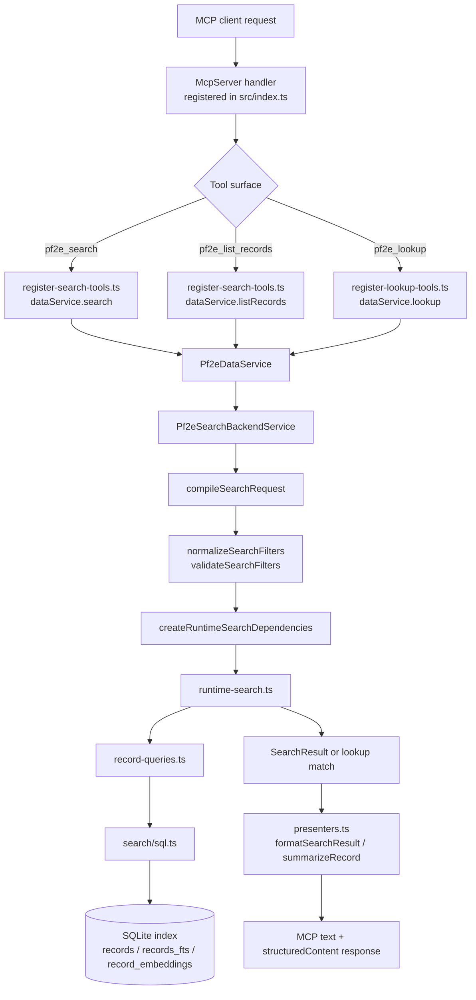

# Search Runtime Architecture

Back to [Architecture Overview](./overview.md).

This document focuses on the current runtime architecture for MCP search and lookup behavior. It describes how a request moves from registered MCP tools through `Pf2eDataService`, into the backend search service, through the shared runtime search pipeline, and back out through response presenters.

It also covers the startup and index lifecycle that make runtime search possible, because the request path depends on a prepared SQLite index, a compatible embedding provider, and the current ranking configuration.

## Scope

The search runtime is shared infrastructure, not an MCP-only feature. The same backend search stack also supports count and search-window behavior used by the TUI. The important ownership split is:

- `src/index.ts` and `src/server/` own MCP registration and wire-format responses.
- `src/domain/search-request-types.ts` owns `SearchRequest`, the shared semantic query contract.
- `src/domain/metadata-field-types.ts` and `src/domain/metadata-filter-types.ts` own the metadata field vocabulary and metadata query AST carried by `SearchRequest`.
- `src/app/runtime.ts` owns application startup composition.
- `src/data/service.ts` exposes `Pf2eDataService`, the main facade for server and TUI callers.
- `src/search/request-compilation.ts` and `src/search/contracts.ts` own the lowering from `SearchRequest` into search-execution filters.
- `src/search/filters/` owns execution-filter normalization, validation, vocabulary semantics, and in-memory matching, while `src/data/backend/search-service.ts` owns backend wiring and runtime dependency assembly.
- `src/search/runtime-search.ts` owns ranked and structured search execution.
- `src/search/sql.ts` and `src/data/record-queries.ts` own SQL construction and database retrieval.

## Runtime Composition

Normal MCP startup is intentionally thin:

1. `src/index.ts` calls `loadPf2eApplicationRuntime()`.
2. `src/app/runtime.ts` loads config from CLI/env via `loadConfig()`.
3. `src/app/runtime.ts` creates a long-lived `RankingConfigStore`.
4. `Pf2eDataService.load(...)` opens the prepared data runtime through `src/data/backend/load-runtime.ts`.
5. `src/index.ts` registers search, lookup, and rule tools against one long-lived `Pf2eDataService`.

The long-lived runtime holds:

- a validated SQLite connection
- loaded pack metadata and record counts
- the active embedding provider
- the ranking config store and its status/warnings
- a `Pf2eRecordCatalog`
- a `Pf2eSearchBackendService`
- a `Pf2eRuleGraphBackendService`

That means MCP handlers do not construct search dependencies on their own. They reuse the same backend service graph for every request.

## Request And Data Flow

### What stays thin

The MCP layer mainly does three things:

- validates request shape with Zod schemas in `src/server/tool-schemas.ts`
- adapts surface-local inputs into `SearchRequest`
- forwards semantic query intent into `Pf2eDataService`
- shapes backend records into MCP-friendly text and `structuredContent`

It does not own SQL, fusion, reranking, or corpus normalization.

### Search vs. lookup vs. browse

The backend deliberately routes similar requests through different runtime modes:

- `pf2e_search` calls `dataService.search(...)` and can resolve to `structured`, `lexical`, or `hybrid` execution.
- `pf2e_lookup` calls `dataService.lookup(...)`, which builds a lookup `SearchRequest` with `intent: "lookup"`, `text`, and `limit: 5` before running the structured runtime path.
- `pf2e_list_records` calls `dataService.listRecords(...)`, which uses structured SQL listing only and never enters ranked retrieval.

So lookup is not a separate search engine. It is a constrained structured search path optimized for exact-name matching and small alternative sets.

## Search Pipeline

### 1. Semantic request compilation

`SearchRequest` is the cross-surface search contract. MCP adapters, TUI query adapters, and ontology-origin queries all converge on that one semantic model before backend execution begins.

That shared semantic contract includes the metadata query subtree. Metadata field names, field kinds, predicate operators, and metadata boolean-group AST nodes are domain-owned because they are part of cross-surface query meaning, not search-runtime execution details.

`compileSearchRequest(...)` in `src/search/request-compilation.ts` lowers semantic query intent into search-execution filters by:

- mapping `intent` and `text` onto `query` or `nameQuery`
- lowering first-class request parts such as `subcategory`, `levelRange`, `rarityPolicy`, and `actionCostPolicy`
- converting metadata request parts into the metadata filter DSL
- preserving shared pagination, link, pack, price, explain, and exclusion settings

Search-execution filters are not the shared contract. They are search-owned compiled output used by normalization, validation, SQL construction, and runtime execution.

The backend does not preserve a hidden compatibility path for legacy filter-shaped inputs. Surface adapters and ontology query carriers must provide real `SearchRequest` values before execution begins.

### 2. Filter normalization and validation

`Pf2eSearchBackendService` is the control point before runtime search starts.

`normalizeSearchFilters(...)` in `src/search/filters/normalization.ts`:

- canonicalizes `category`, `subcategory`, and `scopes`
- resolves a user-supplied pack label back to its canonical pack name when possible
- deduplicates `linksTo` and `excludeLinksTo`
- normalizes the metadata filter DSL

`validateSearchFilters(...)` then enforces mode rules such as:

- `pf2e_list_records` cannot use `query`, `excludeQuery`, or `searchProfile`
- `pf2e_search` must provide text and/or structured filters
- `scopes` cannot be combined with top-level `category` or `subcategory`
- subcategories must belong to their categories

### 3. Runtime dependency assembly

`createRuntimeSearchDependencies(...)` turns backend services into the small interface expected by `src/search/runtime-search.ts`.

That dependency object provides:

- `fetchCandidateCount`
- `fetchPagedCandidates`
- `fetchCandidates`
- `fetchLexicalRetrievalRows`
- `fetchSemanticRetrievalRows`
- alias lookup for name scoring
- the current ranking config and ranking-config status
- the embedding provider

This keeps `runtime-search.ts` independent from direct `DatabaseSync` and catalog wiring details.

### 4. Mode resolution

`src/search/ranking.ts` decides which runtime path to use:

- `structured`: no free-text `query`, including browse/list flows and lookup-style `nameQuery` searches
- `lexical`: `searchProfile: "lexical"` with a free-text `query`
- `hybrid`: free-text `query` with `balanced`, `concept`, or default search behavior

Default MCP search behavior is important here:

- `pf2e_search` with `query` but no explicit profile becomes `balanced` hybrid search
- `pf2e_search` with only structured filters stays structured
- `pf2e_lookup` always stays structured because lookup intent compiles to `nameQuery`, not `query`

### 5. SQL candidate filtering

The SQL filter stage is shared across browse, lexical retrieval, semantic retrieval, and candidate hydration.

`applySearchFilterClauses(...)` in `src/search/sql.ts` adds the core boundaries:

- `is_search_canonical = 1`
- exact pack or pack-label match
- `category`, `subcategory`, or multi-scope category/subcategory pairs
- `levelMin`, `levelMax`, `rarity`, `priceMin`, `priceMax`, and `actionCost`
- metadata DSL predicates
- exact link inclusion/exclusion against `reference_edges`

This stage feeds several query builders:

- `buildCandidateQuery(...)` for hydrated candidate rows
- `buildCandidateCountQuery(...)` for counts
- `buildLexicalRetrievalQuery(...)` for FTS retrieval over `records_fts`
- `buildSemanticRetrievalQuery(...)` for vector retrieval over `record_embeddings`

The lexical and semantic retrieval queries reuse the same structural constraints, which keeps ranked search bounded by the same category, metadata, and link filters as structured browse.

### 6. Structured runtime path

Structured execution is used by browse flows and lookup-like name matching.

`buildStructuredSearchEntries(...)`:

- fetches SQL-filtered candidates
- optionally removes records whose `search_text` contains excluded query tokens
- scores each record with either:
  - `nameScore(...)` when `nameQuery` is present
  - or a neutral baseline of `0.5` when it is not
- adds rerank adjustments from ranking config
- sorts either by ranked score or explicit user sort

The rerank adjustments come from `src/search/ranking.ts` and currently include:

- pack quality
- source quality
- rarity preference
- source penalties for metadata-only or scenario-style records

Lookup uses this path directly, then returns the first result as `match` and the remaining results as `alternatives`.

### 6. Lexical retrieval path

Lexical mode begins with `buildSearchQueryAnalysis(...)`, which normalizes the query and builds reusable token weights for:

- trait overlap
- name overlap
- metadata overlap

The runtime then:

1. builds an FTS query from normalized tokens
2. runs `fetchLexicalRetrievalRows(...)` against `records_fts`
3. hydrates retrieved record keys through `fetchCandidates(...)`
4. rechecks normalized records with `recordMatchesFilters(...)`
5. computes a lexical rerank score with `buildLexicalSignal(...)`
6. adds rerank adjustments
7. sorts by total score, then lexical details, then stable record ordering

The lexical retrieval rank itself is not the final output rank. It is one input to the reranked result order.

### 7. Hybrid retrieval and fusion

Hybrid mode combines lexical and semantic retrieval:

1. lexical analysis runs exactly as above
2. the raw free-text query is embedded with the configured embedding provider
3. semantic retrieval runs against `record_embeddings`
4. lexical and semantic candidate keys are unioned
5. hydrated candidates are rechecked in normalized-record form
6. the lexical side is reranked and trimmed to `lexicalTopK`
7. the semantic side is trimmed to `semanticTopK`
8. `computeWeightedRrfScore(...)` fuses the two rank lists with weighted reciprocal-rank fusion
9. rerank adjustments are added on top of the fusion score

The fusion profile comes from the active ranking config:

- `balanced` favors lexical evidence more heavily
- `concept` favors semantic evidence more heavily

`RankingConfigStore` is long-lived and watched by default, so changed ranking config values can affect later requests without rebuilding the runtime.

### 8. Response shaping and explain output

`runtime-search.ts` builds a full in-memory snapshot, then slices it to the requested `offset` and `limit`.

When `pf2e_search` sets `explain: true`, the response includes:

- resolved search profile and mode
- fusion method and fusion profile
- effective fusion config summary
- normalized lexical and semantic query context
- per-record explanation entries aligned to the sliced records
- ranking-config status

The MCP layer then shapes that into wire output:

- `formatSearchResult(...)` builds the human-readable text block
- `summarizeRecord(...)` builds structured record summaries
- search results attach explanation rows as `searchExplain`
- lookup returns `match` plus optional summarized alternatives

## Startup, Config, And Index Lifecycle

Runtime search only works when startup, embeddings, and index validation all agree.

### Config loading

`src/app/config.ts` resolves:

- PF2E data path and manifest
- SQLite index path
- embedding provider/model/revision/cache paths
- ranking config path

The config can come from CLI flags or environment variables. `loadConfig()` resolves paths before runtime services are built.

### Runtime load path

`loadPf2eDataRuntime(...)` in `src/data/backend/load-runtime.ts`:

1. resolves the index path and embedding config
2. creates the embedding provider
3. computes a source signature from the PF2E checkout + manifest
4. verifies the index exists
5. opens the database
6. checks that the index matches the current source signature and embedding provider identity
7. loads packs, record counts, and startup warnings

This is why normal startup is offline-only. The embedding provider must already be locally available, and the index must already have been built for the current source and embedding identity.

### Rebuild path

`npm run refresh-index` executes `src/refresh-index.ts`, which:

1. loads config
2. calls `Pf2eDataService.rebuildIndex(...)`
3. rebuilds the SQLite schema and indexed records
4. optionally reuses unchanged embeddings when `--reuse-embeddings` is enabled
5. rewrites the ontology explorer cache
6. writes the metadata glossary artifact

That rebuild path is separate from MCP startup by design. The runtime expects prepared assets rather than mutating them during a request-serving process.

## Architectural Notes

- Search mechanics are intentionally centralized in `src/search/runtime-search.ts` so MCP and TUI flows do not drift into competing ranking implementations.
- `Pf2eSearchBackendService` is the boundary where user-facing filters become validated runtime search inputs.
- SQL applies the first-pass corpus boundary, while `recordMatchesFilters(...)` provides a normalized-record recheck before final ranking.
- Response presenters are deliberately downstream of ranking. Presentation code should never decide ranking or candidate inclusion.
- Lookup remains a structured search specialization, not a separate retrieval stack.
