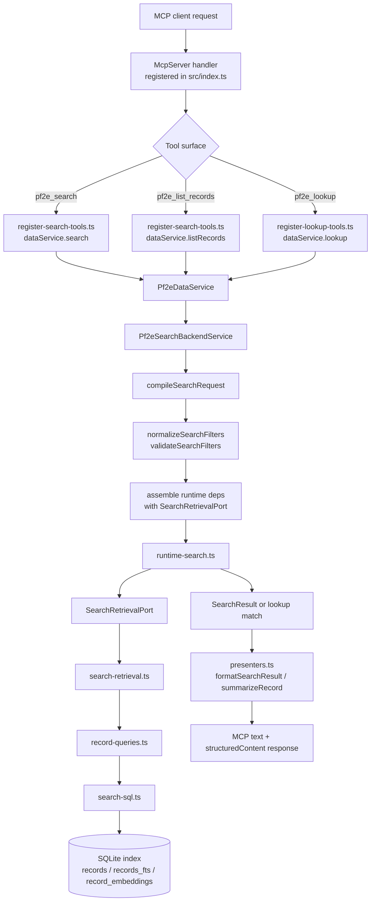
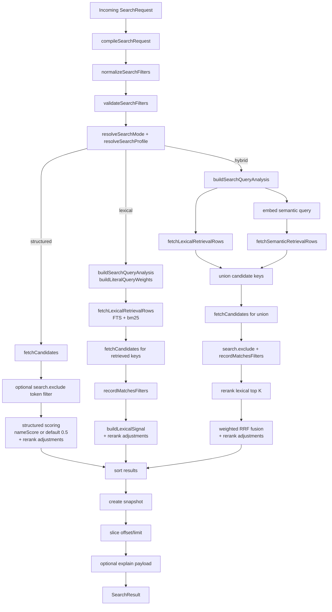

# Search Runtime Architecture

Back to [Architecture Overview](./overview.md).

This document focuses on the current runtime architecture for MCP search and lookup behavior. It describes how a request moves from registered MCP tools through `Pf2eDataService`, into the backend search service, through the shared runtime search pipeline, and back out through response presenters.

It also covers the startup and index lifecycle that make runtime search possible, because the request path depends on a prepared SQLite index, a compatible embedding provider, and the current ranking configuration.

## Scope

The search runtime is shared infrastructure, not an MCP-only feature. The same backend search stack also supports count and search-window behavior used by the TUI. The important ownership split is:

- `src/index.ts` and `src/server/` own MCP registration and wire-format responses.
- `src/domain/search-request-types.ts` owns `SearchRequest` and the canonical shared filter tree.
- `src/domain/metadata-field-catalog.ts`, `src/domain/metadata-field-types.ts`, and `src/domain/search-filter-metadata.ts` own the public metadata field catalog, metadata field vocabulary, and atomic metadata predicates carried by that contract.
- `src/app/runtime.ts` owns application startup composition.
- `src/data/service.ts` exposes `Pf2eDataService`, the main facade for server and TUI callers.
- `src/search/request-compilation.ts` and `src/search/contracts.ts` own the lowering from `SearchRequest` into search-execution filters.
- `src/search/filters/` owns execution-filter normalization, validation, metadata normalization helpers, and in-memory matching, while `src/data/backend/search-service.ts` owns backend wiring.
- `src/data/metadata-row-projection.ts` owns metadata row selection and hydration mapping for normalized records.
- `src/data/backend/search-sql.ts`, `src/data/backend/metadata-search-sql.ts`, `src/data/record-queries.ts`, and `src/data/backend/search-retrieval.ts` own SQL construction, database retrieval, row-to-record hydration, and the concrete implementation of the search retrieval port.
- `src/server/metadata-presentation.ts` owns MCP summary/detail metadata projection.
- `src/search/runtime-search.ts` owns ranked and structured search execution.
- `src/search/contracts.ts` owns the storage-agnostic retrieval port consumed by runtime search.

## Runtime Composition

Normal MCP startup is intentionally thin:

1. `src/index.ts` calls `loadPf2eApplicationRuntime()`.
2. `src/app/runtime.ts` loads config from CLI/env via `loadConfig()`.
3. `src/app/runtime.ts` creates a long-lived `RankingConfigStore`.
4. `Pf2eDataService.load(...)` opens the prepared data runtime through `src/data/backend/load-runtime.ts`.
5. `src/index.ts` registers search, lookup, and rule tools against one long-lived `Pf2eDataService`.

The long-lived runtime holds:

- a validated SQLite connection
- loaded pack metadata and record counts
- the active embedding provider
- the ranking config store and its status/warnings
- a `Pf2eRecordCatalog`
- a `Pf2eSearchBackendService`
- a `Pf2eRuleGraphBackendService`

Runtime search and discovery code can receive an optional trace sink from a composition root. This is diagnostics-only:
normal MCP and TUI runs do not install a sink, while `PF2E_TUI_DEBUG=1` wires the TUI debug service into `Pf2eDataService`
so filter discovery can report nested search, SQL, and matching-set timings without changing request or response contracts.

That means MCP handlers do not construct search dependencies on their own. They reuse the same backend service graph for every request.

## Request And Data Flow



### What stays thin

The MCP layer mainly does three things:

- validates request shape with Zod schemas in `src/server/tool-schemas.ts`
- adapts surface-local inputs into `SearchRequest`
- forwards semantic query intent into `Pf2eDataService`
- shapes backend records into MCP-friendly text and `structuredContent`

It does not own SQL, fusion, reranking, or corpus normalization.

### Search vs. lookup vs. browse

The backend deliberately routes similar requests through different runtime modes:

- `pf2e_search` exposes the `mode: "search"` branch of `SearchRequest`: it requires `search.query`, may include `search.exclude` and `search.profile`, and can resolve to `lexical` or `hybrid` execution depending on profile.
- `pf2e_lookup` calls `dataService.lookup(...)`, which builds a lookup `SearchRequest` with `mode: "lookup"`, `search.query`, and `limit: 5` before running the structured runtime path.
- `pf2e_list_records` exposes the `mode: "browse"` branch of `SearchRequest`: it uses the canonical root `filter`, optional browse `sort`, and pagination, then stays on structured SQL listing only.

So lookup is not a separate search engine. It is a constrained structured search path optimized for exact-name matching and small alternative sets.

### Canonical Shapes

The architecture hinges on one shared semantic request shape and one search-owned compiled shape. The fields below are the architecture-significant parts of the real contracts.

```ts
type SearchRequest =
  | {
      mode: "browse";
      filter?: SearchFilterNode;
      sort?: BrowseSortSpec;
      offset?: number;
      limit?: number;
    }
  | {
      mode: "search";
      search: {
        query: string;
        exclude?: string;
        profile?: SearchProfile;
      };
      filter?: SearchFilterNode;
      explain?: boolean;
      offset?: number;
      limit?: number;
    }
  | {
      mode: "lookup";
      search: {
        query: string;
      };
      filter?: SearchFilterNode;
      sort?: LookupSortSpec;
      offset?: number;
      limit?: number;
    };

type SearchFilterNode =
  | { kind: "pack"; value: string }
  | {
      kind: "scope";
      category: SearchCategoryInput;
      subcategory:
        | { kind: "any" }
        | { kind: "eq"; value: SearchSubcategoryInput }
        | { kind: "isNull" }
        | { kind: "isNotNull" };
    }
  | { kind: "level" | "price"; match: SearchNumericMatch }
  | { kind: "rarity"; match: SearchNullableStringMatch }
  | { kind: "actionCost"; match: SearchNullableNumericMatch }
  | { kind: "linksTo"; target: RecordKey }
  | { kind: "linkedFrom"; source: RecordKey }
  | { kind: "metadataPredicate"; predicate: MetadataAtomicPredicate }
  | { kind: "metric"; metric: string; op: MetricOperator; value: string | number | boolean }
  | { kind: "metricCompare"; leftMetric: string; op: NumericMetricOperator; rightMetric: string }
  | { kind: "anyOf" | "allOf"; children: SearchFilterNode[] }
  | { kind: "not"; child: SearchFilterNode };

interface SearchExecutionFilters {
  searchProfile?: SearchProfile;
  sort?: SearchSort;
  sortSeed?: number;
  explain?: boolean;
  nameQuery?: string;
  query?: string;
  excludeQuery?: string;
  filter?: SearchExecutionFilterNode;
  offset?: number;
  limit?: number;
}
```

`SearchRequest` is the cross-surface contract carried by MCP, TUI, and ontology-origin flows. Exact relation leaves such as `linksTo` and `linkedFrom` carry canonical record keys at that boundary. `SearchExecutionFilters` is the compiled search-owned runtime input after mode resolution, request lowering, and filter normalization.

## Search Pipeline



### 1. Semantic request compilation

`SearchRequest` is the cross-surface search contract. MCP adapters, TUI query adapters, and ontology-origin queries all converge on that one semantic model before backend execution begins.

That shared semantic contract includes metadata field names, field kinds, and atomic metadata predicate operators as part of cross-surface query meaning. Boolean composition is owned by the canonical `SearchFilterNode` tree itself via `allOf`, `anyOf`, and `not`, not by a separate metadata-owned grouped AST.

Top-level numeric matcher leaves preserve exact, strict, inclusive, and bounded-range semantics as distinct canonical variants. The shared contract treats `eq`, `gt`, `gte`, `lt`, `lte`, and `between` as different matcher kinds rather than editor sugar over a smaller inclusive-only model.

The canonical filter tree also owns symmetric exact record-link leaves over the shared `reference_edges` surface:

- `linksTo`
  candidate record links to the given target record key
- `linkedFrom`
  candidate record is linked from the given source record key

Programmatic seeded browse/query pathways, such as page and drill surfaces, should emit those canonical leaves directly instead of inventing feature-local record-key-set escape hatches.

`compileSearchRequest(...)` in `src/search/request-compilation.ts` lowers semantic query intent into search-execution filters by:

- reading the canonical `mode` branch and its mode-specific fields
- lowering the root `filter` tree into execution-facing constraints such as scope, ranges, links, metadata predicates, and metric predicates
- preserving symmetric exact record-link leaves such as `linksTo` and `linkedFrom`
- mapping `search.query`, `search.exclude`, and `search.profile` onto the appropriate ranked-search execution inputs
- preserving shared pagination, explain, pack-label resolution, and browse or lookup sort settings where that mode allows them

Search-execution filters are not the shared contract. They are search-owned compiled output used by normalization, validation, and runtime execution. Data-owned retrieval modules lower those filters into SQLite queries through the search retrieval port.

The backend does not preserve a hidden compatibility path for legacy `intent` / `parts` / flat-root-filter inputs. Surface adapters and ontology query carriers must provide real `SearchRequest` values before execution begins.

This request-model convergence also does not introduce a durable migration surface. There is no persisted search-session or query document format to rewrite, and the prepared index/runtime assets stay unchanged. The cleanup is a live contract change at the transport and UI edges, not a database or cache migration.

### 2. Filter normalization and validation

`Pf2eSearchBackendService` is the control point before runtime search starts.

`normalizeSearchFilters(...)` in `src/search/filters/normalization.ts`:

- canonicalizes scope, range, and boolean filter nodes
- resolves a user-supplied pack label back to its canonical pack name when possible
- lowers boolean filter composition and negated link clauses into the execution filter shape
- normalizes atomic metadata predicates and metric predicates inside the filter tree

`validateSearchFilters(...)` then enforces mode rules such as:

- browse/list requests cannot carry a `search` branch or `explain`
- search requests must carry `search.query`
- lookup requests carry `search.query` but not ranked-search profile controls
- scope leaves and their category/subcategory pairings must stay semantically valid

### 3. Runtime dependency assembly

`Pf2eSearchBackendService` assembles the small runtime dependency object expected by `src/search/runtime-search.ts`. The storage-specific part of that object is the `SearchRetrievalPort` implemented by `src/data/backend/search-retrieval.ts`.

That dependency object provides:

- `fetchCandidateCount`
- `fetchPagedCandidates`
- `fetchCandidates`
- `fetchLexicalRetrievalRows`
- `fetchSemanticRetrievalRows`
- alias lookup for name scoring
- the current ranking config and ranking-config status
- the embedding provider

This keeps `runtime-search.ts` independent from direct `DatabaseSync`, SQL query builders, row hydration, and catalog wiring details. The data layer owns the physical SQLite implementation behind the port.

### 4. Mode resolution

`src/search/ranking.ts` decides which runtime path to use:

- `structured`: browse/list flows and lookup-style name matching
- `lexical`: `mode: "search"` with `search.profile: "lexical"`
- `hybrid`: `mode: "search"` with `balanced`, `concept`, or default search behavior

Default MCP search behavior is important here:

- `pf2e_search` with `search.query` but no explicit profile becomes `balanced` hybrid search
- `pf2e_search` does not have a structured-only public branch; structured browse belongs on `pf2e_list_records`
- `pf2e_lookup` always stays structured because lookup compiles to exact-name matching rather than ranked free-text retrieval

### 5. SQL candidate filtering

The SQL filter stage is data-owned and shared across browse, lexical retrieval, semantic retrieval, and candidate hydration.

`applySearchFilterClauses(...)` in the data-owned search SQL builder adds the core boundaries:

- `is_search_canonical = 1`
- exact pack or pack-label match
- scope-derived category/subcategory pairs
- level, rarity, price, and action-cost constraints lowered from canonical filter leaves
- metadata and metric predicates lowered from the canonical filter tree
- exact `reference_edges` constraints for both `linksTo` and `linkedFrom`, including their negated forms

This stage feeds several query builders:

- `buildCandidateQuery(...)` for hydrated candidate rows
- `buildCandidateCountQuery(...)` for counts
- `buildLexicalRetrievalQuery(...)` for FTS retrieval over `records_fts`
- `buildSemanticRetrievalQuery(...)` for vector retrieval over `record_embeddings`

The lexical and semantic retrieval queries reuse the same structural constraints, which keeps ranked search bounded by the same category, metadata, and link filters as structured browse.

When a backend caller already has a concrete matching record-key set, candidate and filter-value SQL still goes through this shared SQL builder. Those record-key-constrained queries explicitly drive `records` through the table primary-key index so repeated value-count discovery over a matching set does not accidentally use broader catalog indexes such as the search-canonical index.

### 6. Structured runtime path

Structured execution is used by browse flows and lookup-like name matching.

`buildStructuredSearchEntries(...)`:

- fetches SQL-filtered candidates
- optionally removes records whose `search_text` contains excluded query tokens
- scores each record with either:
  - `nameScore(...)` when lookup-style name matching is present
  - or a neutral baseline of `0.5` when it is not
- adds rerank adjustments from ranking config
- sorts either by explicit browse or lookup sort, or by the default structured ordering for that mode

The rerank adjustments come from `src/search/ranking.ts` and currently include:

- pack quality
- source quality
- rarity preference
- source penalties for metadata-only or scenario-style records

Lookup uses this path directly, then returns the first result as `match` and the remaining results as `alternatives`.

### 6. Lexical retrieval path

Lexical mode begins with `buildSearchQueryAnalysis(...)`, which normalizes the query and builds reusable token weights for:

- trait overlap
- name overlap
- metadata overlap

The runtime then:

1. builds an FTS query from normalized tokens
2. runs `fetchLexicalRetrievalRows(...)` against `records_fts`
3. hydrates retrieved record keys through `fetchCandidates(...)`
4. rechecks normalized records with `recordMatchesFilters(...)`
5. computes a lexical rerank score with `buildLexicalSignal(...)`
6. adds rerank adjustments
7. sorts by total score, then lexical details, then stable record ordering

The lexical retrieval rank itself is not the final output rank. It is one input to the reranked result order.

### 7. Hybrid retrieval and fusion

Hybrid mode combines lexical and semantic retrieval:

1. lexical analysis runs exactly as above
2. the raw free-text query is embedded with the configured embedding provider
3. semantic retrieval runs against `record_embeddings`
4. lexical and semantic candidate keys are unioned
5. hydrated candidates are rechecked in normalized-record form
6. the lexical side is reranked and trimmed to `lexicalTopK`
7. the semantic side is trimmed to `semanticTopK`
8. `computeWeightedRrfScore(...)` fuses the two rank lists with weighted reciprocal-rank fusion
9. rerank adjustments are added on top of the fusion score

The fusion profile comes from the active ranking config:

- `balanced` favors lexical evidence more heavily
- `concept` favors semantic evidence more heavily

`RankingConfigStore` is long-lived and watched by default, so changed ranking config values can affect later requests without rebuilding the runtime.

### 8. Response shaping and explain output

`runtime-search.ts` builds a full in-memory snapshot, then slices it to the requested `offset` and `limit`.

When `pf2e_search` sets `explain: true`, the response includes:

- resolved search profile and mode
- fusion method and fusion profile
- effective fusion config summary
- normalized lexical and semantic query context
- per-record explanation entries aligned to the sliced records
- ranking-config status

The MCP layer then shapes that into wire output:

- `formatSearchResult(...)` builds the human-readable text block
- `summarizeRecord(...)` builds structured record summaries
- search results attach explanation rows as `searchExplain`
- lookup returns `match` plus optional summarized alternatives

## Startup, Config, And Index Lifecycle

Runtime search only works when startup, embeddings, and index validation all agree.

### Config loading

`src/app/config.ts` resolves:

- PF2E data path and manifest
- SQLite index path
- embedding provider/model/revision/cache paths
- ranking config path

The config can come from CLI flags or environment variables. `loadConfig()` resolves paths before runtime services are built.

### Runtime load path

`loadPf2eDataRuntime(...)` in `src/data/backend/load-runtime.ts`:

1. resolves the index path and embedding config
2. creates the embedding provider
3. computes a source signature from the PF2E checkout + manifest
4. verifies the index exists
5. opens the database
6. checks that the index matches the current source signature and embedding provider identity
7. loads packs, record counts, and startup warnings

This is why normal startup is offline-only. The embedding provider must already be locally available, and the index must already have been built for the current source and embedding identity.

### Rebuild path

`npm run refresh-index` executes `src/refresh-index.ts`, which:

1. loads config
2. calls `Pf2eDataService.rebuildIndex(...)`
3. rebuilds the SQLite schema and indexed records
4. optionally reuses unchanged embeddings when `--reuse-embeddings` is enabled
5. rewrites the ontology explorer cache
6. writes the metadata glossary artifact

That rebuild path is separate from MCP startup by design. The runtime expects prepared assets rather than mutating them during a request-serving process.

The prepared SQLite index also owns static metric discovery facts. `src/data/indexer.ts` materializes `metric_key_catalog` and `metric_value_catalog` during index refresh from canonical `actor_metrics` and `item_metrics` rows. The key catalog stores metric field, category, exact subcategory plus category-wide `*` rows, namespace prefix, metric key, value type, catalog count, and numeric min/max summaries. The value catalog stores exact text and boolean value counts. Numeric metric values are summarized on the key catalog and are not expanded into value rows.

Runtime readers access those tables through `Pf2eDataService` and `src/data/backend/metric-catalog.ts`. App discovery code may use that facade for catalog-mode metric keys and values; TUI, server, and ontology builders must not read the SQLite catalog tables directly. Query-scoped matching counts still use live discovery so active search text and filters remain exact. Prepared catalog explorer domains are keyed by scope and requested target fields because catalog facts are static within a category or subcategory. Prepared matching explorer caches are split into a static applicability key for scope and target fields plus a live key for the full canonical request, so adjacent query states share the same static cache boundary while request-specific counts remain exact.

## Architectural Notes

- Search mechanics are intentionally centralized in `src/search/runtime-search.ts` so MCP and TUI flows do not drift into competing ranking implementations.
- `Pf2eSearchBackendService` is the boundary where user-facing filters become validated runtime search inputs.
- SQL applies the first-pass corpus boundary, while `recordMatchesFilters(...)` provides a normalized-record recheck before final ranking.
- Response presenters are deliberately downstream of ranking. Presentation code should never decide ranking or candidate inclusion.
- Lookup remains a structured search specialization, not a separate retrieval stack.
