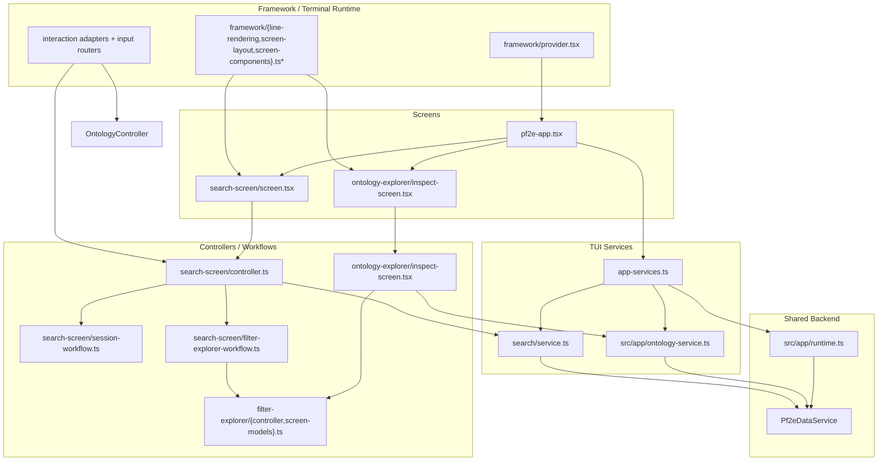

# TUI Architecture

This document describes how the terminal UI is assembled, where its boundaries live, and how it reuses the same backend runtime as the MCP server without pulling terminal concerns into shared services.

## What The TUI Owns

The TUI in `src/tui/` is a separate presentation surface over the same prepared PF2E index and search runtime used elsewhere in the repository.

Its job is to own:

- terminal rendering and input handling
- screen state, workflow state, and interaction routing
- user-facing search editing and ontology navigation flows
- editorial workbench entrypoints for tag-review tasks

It should not own:

- SQLite lifecycle management
- search ranking internals
- ontology domain construction
- normalized catalog access

Those responsibilities stay below the TUI behind app-layer and backend facades.

## Composition Root

`src/tui/app-services.ts` is the TUI composition root. It builds a terminal-oriented service bundle from the shared application runtime:

- `loadPf2eApplicationRuntime()` from `src/app/runtime.ts` loads config and the long-lived `Pf2eDataService`
- `createPf2eApplicationStorageService()` supplies app-scoped storage helpers for workflows that need direct index access, such as editorial workbench flows
- `createPf2eApplicationOntologyService()` prepares cached search-semantics browse models for the ontology area from config, the shared data facade, and the shared app-layer discovery service
- `createPf2eTerminalSearchService()` adapts shared catalog/search capabilities into a TUI-facing query/session API
- the derived-tag workbench services are wired in as a development/editorial area, not mixed into the user search and ontology APIs

That gives the terminal app one explicit dependency object, `Pf2eTerminalAppServices`, with a clear split:

- `user`: TUI-facing services for ontology and search
- `dev`: editorial workbench services

## Runtime Flow

```mermaid
flowchart TD
  Entry["`runPf2eTerminalApp()`\n`src/tui/pf2e-app.tsx`"] --> Framework["Ink runtime + `DerivedTagTerminalProvider`\n`src/tui/framework/provider.tsx`"]
  Framework --> Bootstrap["`Pf2eTerminalBootstrap`"]
  Bootstrap --> Load["`loadPf2eTerminalAppServices(argv)`\n`src/tui/app-services.ts`"]

  Load --> Runtime["`loadPf2eApplicationRuntime()`\n`src/app/runtime.ts`"]
  Runtime --> Config["App config"]
  Runtime --> Data["`Pf2eDataService`"]

  Load --> Storage["`createPf2eApplicationStorageService()`"]
  Load --> Discovery["`createPf2eApplicationSearchDiscoveryService(dataService)`"]
  Load --> Ontology["`createPf2eApplicationOntologyService(config, dataService, discovery)`"]
  Load --> Search["`createPf2eTerminalSearchService(...)`"]
  Load --> Dev["Derived-tag workbench services"]

  Data --> Discovery
  Data --> Search
  Data --> Ontology
  Discovery --> Ontology
  Storage --> Dev

  Load --> App["`Pf2eTerminalApp`"]
  App --> Context["`Pf2eTerminalAppServicesProvider`"]
  Context --> Screens["Area menu, Search screen,\nOntology explorer, Tag workflows"]
```

The important architectural point is that the TUI does not rebuild backend logic. It composes shared services once, then keeps terminal behavior local to the screen tree.

## Shared Backend, Local UI

The TUI shares backend services in two ways:

- search flows are built on top of a TUI-facing search facade backed by the shared `Pf2eDataService`
- ontology browsing is built from the same app-layer ontology service used to assemble readonly domain models

But the TUI keeps UI concerns local:

- `Pf2eTerminalApp` owns top-level navigation orchestration through a dedicated route-transition coordinator rather than ad hoc route mutations in screen callbacks
- screen controllers own transient selection, pane focus, and detail-scroll state
- workflows own prompt flows, modal handoffs, session cleanup, and live-count/result-window behavior
- framework modules own Ink-specific rendering, modal hosting, terminal sizing, and raw input normalization
- shared list/detail owners now own repeated pane measurement, screen-model assembly, shared interaction-context setup, compact default result rows, shared breadcrumb formatting, the reusable rightward behavior contract for screens that follow the common list/detail pattern, and the shared grouped-result presentation path for compatible result readers

This split matters because it lets the TUI add richer interaction behavior without pushing terminal concepts like pane focus, action rails, or staged editors down into `src/app/`, `src/data/`, or `src/search/`.

Shared ontology/detail presenters may also attach optional link metadata to a text line, such as `href` plus a plain-text fallback string. The shared TUI framework owns hyperlink rendering for those lines: supported terminals get a clickable OSC 8 hyperlink, while unsupported terminals and plain-text consumers fall back to a readable `label: url` string.

## Major TUI Layers

### Framework Layer

`src/tui/framework/` contains the terminal mechanics:

- Ink provider lifecycle in `framework/provider.tsx`
- line rendering and wrapping in `framework/line-rendering.tsx`
- pane and screen geometry in `framework/screen-layout.ts`
- pane and screen React components in `framework/screen-components.tsx`
- input and navigation helpers in `framework/input.ts`
- terminal context in `framework/context.ts`
- modal host and input routing in `framework/modal-host.tsx`
- modal sizing and layout planning in `framework/modal-planning.ts`
- modal prompt bodies in `framework/modal-prompt-bodies.tsx`
- centered-prompt presentation naming and background treatment normalization in `framework/prompt-presentation.ts`
- prompt-session ownership in `framework/provider.tsx`, where multi-step prompt flows replace the current prompt without exposing an intermediate background frame and keep blanked-background prompt layout separate from background workspace sizing

Feature code should build on these helpers instead of importing raw terminal primitives directly.

### App Services Layer

`src/tui/app-services.ts` and `src/tui/app-service-context.tsx` define what the terminal app can use. This keeps most screens from knowing how runtime assembly works.

The service context is intentionally narrow: screens ask for `services.user.search`, `services.user.ontology`, or `services.dev.*`, not for direct storage or low-level query helpers.

### Navigation Layer

`Pf2eTerminalApp` now routes user-visible navigation through a dedicated coordinator hook in `src/tui/pf2e-navigation.ts`.

That layer owns:

- transition intents such as open area, open search, return/back, and open review session
- prepared route handoffs that may need async work before the destination can be committed
- the mounted-screen transition status contract used to show one shared loader treatment during pending transitions
- route-stack commit operations as navigation-internal detail rather than screen-callback API

The architectural rule is that route screens and menu callbacks should request navigation intent, not dispatch raw push/replace/pop route mutations themselves.

Route readiness is part of that same boundary:

- routes that need data for their first meaningful frame must be prepared before commit
- route screens should mount from render-ready payloads, not kick off route-entry bootstrap work after navigation
- the currently mounted screen hosts the shared transition-status affordance while navigation prepares the next route

### Shared List/Detail Presentation And Behavior Layer

`src/tui/list-detail-presentation.ts`, `src/tui/list-detail-behavior.ts`, and `src/tui/list-detail-formatting.ts` sit above the lower-level interaction/router primitives and below feature controllers.

It owns the repeated mechanics that several screens were previously rebuilding:

- pane body measurement and detail-window slicing
- shared assembly of `TerminalPaneScreen` / `TerminalTwoPaneScreen` props
- common interaction-context setup for list, detail, optional text-entry, and optional action-target flows
- transient footer-banner notifications for lightweight failed-navigation or informational feedback
- reusable rightward list behavior contracts such as `drill`, `open`, `preview`, or `none`
- shared dead-end handling for qualifying list/detail screens, including notification-vs-noop policy and preview-already-visible behavior
- shared breadcrumb and default result-row formatting for list/detail search and explorer surfaces, using the shared ontology/search vocabulary owner for friendly fallback rendering where no explicit alias exists
- shared grouped-result presentation mechanics such as optional section headers, row badges, and light detail metadata lines when a caller supplies grouping or row-presentation metadata

It does not own feature-domain workflows. Search, filter explorer, and review still decide:

- which actions are available in each context
- how list rows, detail lines, and status text are built
- how successful rightward intents map to local reducer actions or async workflow steps
- which non-contract workflow outcomes still warrant local notification or prompt handling

Pane-focus changes remain explicit actions. For qualifying list/detail callers, rightward dead ends must not move focus, and `preview` means "keep the selected row visible in the detail pane without moving focus." If that preview is already satisfied, the shared behavior layer treats the input as a dead end.

The current qualifying callers are the search result reader and the filter explorer in both inspect and compose modes. The derived-tag review screen still uses the shared presentation mechanics, but it does not fit this rightward behavior contract because its primary rightward interaction is an action-target flow rather than list-row confirm behavior.

Use this layer when a screen is fundamentally a list/detail surface with shared pane, footer/help, and routing mechanics. Do not push unrelated staged-editor or domain workflow logic into it just to make a screen fit the abstraction.

Lookup stays a consumer of this shared result-view pathway rather than becoming its own durable presentation owner. Lookup supplies `matchType` plus the selected `tiered` or `global` sort policy, and the shared list/detail presentation layer decides whether that becomes grouped sections, row badges, or a light detail metadata line in the result reader.

### Search Service Layer

`src/tui/search/service.ts` is the TUI-facing search facade. It is not the ranking engine itself. Instead, it:

- keeps canonical `SearchRequest` state as the TUI query model
- uses `query.filter` as the shared semantic filter tree instead of a TUI-local parallel query-part model
- exposes category, subcategory, sort, and facet options for the UI
- converts ontology-origin queries into canonical TUI query state
- opens and reads search windows through the shared backend
- owns TUI session concepts such as result buffers, sort changes, session disposal, and lookup match-type metadata on prepared result rows

This keeps query editing and result reading logic in the TUI while leaving shared query semantics in `src/domain/` and search execution in backend/search-owned services.

Within the search screen, the live workspace no longer renders structured rows directly from raw query state. The search-screen workspace derives a summary/document model from the canonical query state first, then renders:

- workspace rows
- staged structured-query summaries
- query-status/detail summaries

That summary layer owns stable anchors for major query branches and filter nodes. The durable rule is:

- `SearchRequest` is the canonical TUI query state, including the structured filter tree
- query-state helpers own normalization, projection, and interpretation of canonical `query.filter`
- metadata-node adapters may convert between editor-facing metadata nodes and canonical filter nodes, but they do not own a parallel query semantics model
- `SearchRequest` is the shared semantic contract once query state crosses out of the TUI
- the workspace summary/document model owns editor-facing identity and display structure
- terminal renderers consume that summary model instead of re-deriving structured meaning from raw query state in each pane

The dedicated structured editor presents a visible root boolean group for editing, but that editor framing is not itself the durable storage model. Single-child wrapper groups that exist only to support editor presentation should collapse back to the underlying canonical filter node when they do not carry additional shared semantics.

Structured editing keeps only the staged canonical filter projection plus local cursor/move state. Focused add/edit flows such as the query-field builder keep short-lived dialog-local builder state and derive preview summaries from the canonical query shell plus the staged filter nodes they are about to commit.

### Ontology Explorer Layer

`src/tui/ontology-explorer/` still owns ontology-specific hosting concerns, but the durable browse surface is now the shared filter explorer in inspect mode rather than a separate ontology-only screen.

In the current split:

- `src/tui/filter-explorer/` owns the shared list/detail browser, controller-state and inspect/open helpers, route-handling helpers, query/model draft translation, and shared scalar editing prompts
- `src/tui/ontology-explorer/inspect-screen.tsx` is a thin host for a prepared ontology route payload; entering the ontology area now lands directly in that shared inspect session and routes selected leaves into search
- ontology record mapping, detail presentation, and explorer-cache writeback live under `src/app/ontology/`, not TUI-local wrapper files
- `src/tui/ontology-explorer/` legacy browse-only pieces remain isolated and should not become the primary path for new ontology/search exploration work

The ontology host still adds:

- direct entry from the ontology area into the shared search-semantics explorer
- restoring ontology snapshots when the user returns from search
- launching either a seeded search editor route or a prepared result-reader route from selected ontology nodes

The durable rule is that the ontology area does not load its first frame after mount. Navigation prepares the ontology model first, keeps the current screen mounted with the shared transition footer, and commits the ontology route only once the route payload is ready.

## Screen, Workflow, And Controller Split

The TUI generally separates visible screens from stateful interaction logic and service calls.



In practice, the responsibilities break down like this:

- screens choose which visual shell to render and pass callbacks around
- controllers derive screen props from state, terminal size, and selected services
- workflows handle async tasks, prompts, cleanup, and multi-step editing flows
- services translate TUI intent into app/backend operations

That split keeps most feature files from mixing rendering code, terminal event interpretation, and backend access in the same module.

## Search Screen As The Best Example

The search flow shows the intended layering most clearly.

`src/tui/search-screen/screen.tsx` is thin. It decides whether to render:

- the normal search screen
- a shared filter-explorer session
- a structured editor session

`src/tui/search-screen/controller.ts` is the orchestration layer. It:

- pulls `user.search` from the app-service context
- creates the reducer-backed screen state
- derives pane sizes and detail lines from terminal dimensions
- coordinates result sessions, structured editor sessions, and shared filter-explorer sessions
- installs the search interaction router

The async work is pushed further down:

- `search-screen/session-workflow.ts` manages live counts, result-window execution, prefetch, sort changes, and session disposal
- `search-screen/filter-explorer-workflow.ts` opens the shared filter explorer in compose mode for ontology-backed field editing
- `filter-explorer/controller.ts` owns reducer-backed browser state and screen orchestration, while `filter-explorer/workflow-actions.ts` owns command/help/open/compose workflow behavior
- `search-screen/interactions.ts` maps state into terminal actions and help/command models
- `search-screen/query-field-builder-session.ts` owns the structured-editor menu bindings, footer copy, and help sections so staged-query screens do not hand-maintain separate action tables
- `list-detail-presentation.ts` now owns the shared measurement and route-setup seam used by search result-reader, filter explorer, and review screens

The search screen is intentionally render-only at route entry:

- editor/browse routes mount from seeded query state
- result-reader routes mount from a prepared session carried on the route
- navigation-origin execution should happen in the navigation layer before commit, not as a search-screen bootstrap effect after mount

This is the pattern to preserve when the TUI grows: keep rendering, workflow state, and backend calls separate enough that each layer can change without forcing a full rewrite of the others.

## Shared Interaction Conventions

The TUI does not just share low-level input normalization. It also shares user-facing interaction contracts so screens can opt into common behavior instead of redefining it.

### Navigation And Binding Model

The expected interaction stack is:

1. shared key normalization
2. shared interaction verbs and actions
3. shared list/detail navigation helpers
4. shared action-target behavior
5. shared help and footer generation
6. shared list/detail presentation assembly where the screen shape matches that contract
7. screen-specific workflow logic on top

That means:

- vim keys and arrow keys should resolve to the same navigation behavior
- feature screens should prefer shared interaction routers and helpers over branching on raw terminal events
- footer and help text should be derived from the same action tables that actually execute on the screen
- list/detail screens should prefer the shared presentation layer over open-coded pane measurement and route-setup glue once their workflow fits that shape

### Action Rail And Picker Commands

The TUI uses the shared action-target rail for screen-level and selection-level actions. Broad page actions should not fall back to a hidden command palette when the same action set can be surfaced through the rail.

- focused action rails are the default fit for constrained, high-frequency action sets on a selected record, result, or editor surface
- picker-local `supportsCommands` flows are allowed when a modal needs a small mode-switch or auxiliary action path without leaving the picker
- page-specific one-letter commands should remain rare; new screen-specific actions should usually be surfaced through the shared action rail

### Action-Target Contract

When a screen adopts the shared action-target model, preserve the same focus and exit semantics across surfaces:

- `:` is the explicit entry point for command-oriented interactions
- on action-target pages, `:` enters the action target, and `:` or `Esc` leaves it
- on picker-local auxiliary-command pages, `:` invokes the picker's auxiliary command path rather than a separate command-palette surface
- `Enter` applies the selected action
- arrows and vim keys should act inside the focused target only
- persistent action rails should still require explicit entry; users should not move into them accidentally
- `Left` should not be repurposed as a generic exit inside action UIs when it already means horizontal movement there
- `Backspace` should not be treated as a generic exit because prompts and palettes need it for text editing

### Search-Semantics Explorer UX

The shared exploration model also carries a few durable presentation and return-path expectations:

- field and semantic labels should emphasize the entity name; long inline operator lists should not dominate metadata-field views
- derived-tag organization should preserve axis and family structure consistently across search-semantics and scoped query-entry surfaces
- scoped query-field entry should preserve shared explorer state instead of rebuilding a separate picker-only path
- concrete semantic entities that advertise live record counts should open the normal result behavior instead of a special-case sample view

### Modal Presentation Defaults

Prompt and modal sizing should continue to flow through the shared layout planner rather than feature-local sizing heuristics.

- dialog, text, and command prompts default inline
- select-like prompts default to screen-modal unless explicitly overridden
- narrow forced-inline choice prompts should collapse to a readable single-column body instead of forcing an unusable split layout

## Design Rules To Preserve

- Treat `src/tui/app-services.ts` as the TUI composition root. Do not let screens assemble runtime dependencies ad hoc.
- Keep Ink and terminal-framework details in `src/tui/framework/` and shared interaction helpers.
- Route search behavior through `src/tui/search/service.ts` instead of letting screens call backend search APIs directly.
- Treat ontology models from `src/app/ontology-service.ts` as shared readonly inputs; navigation state belongs in the TUI.
- Prefer controllers and workflows for stateful interaction logic; keep screen components mostly declarative.
- Prefer `src/tui/list-detail-presentation.ts` for reusable list/detail pane mechanics instead of rebuilding sizing, visible-detail slicing, and context wiring in each feature controller.
- When a new TUI abstraction becomes the mandatory path, add or extend lint rules so the boundary is enforced rather than implied.
