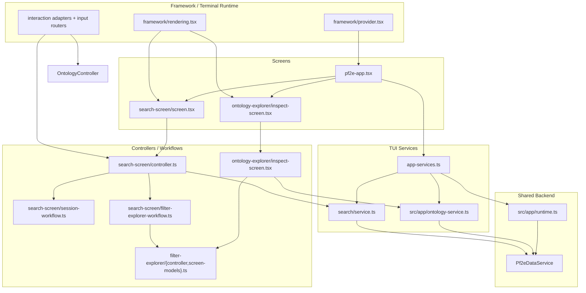

# TUI Architecture

This document describes how the terminal UI is assembled, where its boundaries live, and how it reuses the same backend runtime as the MCP server without pulling terminal concerns into shared services.

## What The TUI Owns

The TUI in `src/tui/` is a separate presentation surface over the same prepared PF2E index and search runtime used elsewhere in the repository.

Its job is to own:

- terminal rendering and input handling
- screen state, workflow state, and interaction routing
- user-facing search editing and ontology navigation flows
- editorial workbench entrypoints for tag-review tasks

It should not own:

- SQLite lifecycle management
- search ranking internals
- ontology domain construction
- normalized catalog access

Those responsibilities stay below the TUI behind app-layer and backend facades.

## Composition Root

`src/tui/app-services.ts` is the TUI composition root. It builds a terminal-oriented service bundle from the shared application runtime:

- `loadPf2eApplicationRuntime()` from `src/app/runtime.ts` loads config and the long-lived `Pf2eDataService`
- `createPf2eApplicationStorageService()` supplies app-scoped storage helpers for workflows that need direct index access
- `createPf2eApplicationOntologyService()` builds cached ontology domains for browsing
- `createPf2eTerminalSearchService()` adapts shared catalog/search capabilities into a TUI-facing query/session API
- the derived-tag workbench services are wired in as a development/editorial area, not mixed into the user search and ontology APIs

That gives the terminal app one explicit dependency object, `Pf2eTerminalAppServices`, with a clear split:

- `catalog`: the shared backend catalog facade backed by `Pf2eDataService`
- `user`: TUI-facing services for ontology and search
- `dev`: editorial workbench services

## Runtime Flow

```mermaid
flowchart TD
  Entry["`runPf2eTerminalApp()`\n`src/tui/pf2e-app.tsx`"] --> Framework["Ink runtime + `DerivedTagTerminalProvider`\n`src/tui/framework/provider.tsx`"]
  Framework --> Bootstrap["`Pf2eTerminalBootstrap`"]
  Bootstrap --> Load["`loadPf2eTerminalAppServices(argv)`\n`src/tui/app-services.ts`"]

  Load --> Runtime["`loadPf2eApplicationRuntime()`\n`src/app/runtime.ts`"]
  Runtime --> Config["App config"]
  Runtime --> Data["`Pf2eDataService`"]

  Load --> Storage["`createPf2eApplicationStorageService()`"]
  Load --> Ontology["`createPf2eApplicationOntologyService(config, dataService, storage)`"]
  Load --> Search["`createPf2eTerminalSearchService(...)`"]
  Load --> Dev["Derived-tag workbench services"]

  Data --> Search
  Data --> Ontology
  Storage --> Ontology
  Storage --> Dev

  Load --> App["`Pf2eTerminalApp`"]
  App --> Context["`Pf2eTerminalAppServicesProvider`"]
  Context --> Screens["Area menu, Search screen,\nOntology explorer, Tag workflows"]
```

The important architectural point is that the TUI does not rebuild backend logic. It composes shared services once, then keeps terminal behavior local to the screen tree.

## Shared Backend, Local UI

The TUI shares backend services in two ways:

- `catalog` is the same `Pf2eDataService` facade pattern used by the rest of the application
- ontology browsing is built from the same app-layer ontology service used to assemble readonly domain models

But the TUI keeps UI concerns local:

- `Pf2eTerminalApp` owns route-stack state and area transitions
- screen controllers own transient selection, pane focus, and detail-scroll state
- workflows own prompt flows, modal handoffs, session cleanup, and live-count/result-window behavior
- framework modules own Ink-specific rendering, modal hosting, terminal sizing, and raw input normalization

This split matters because it lets the TUI add richer interaction behavior without pushing terminal concepts like pane focus, command palettes, or staged editors down into `src/app/`, `src/data/`, or `src/search/`.

## Major TUI Layers

### Framework Layer

`src/tui/framework/` contains the terminal mechanics:

- Ink provider lifecycle in `framework/provider.tsx`
- rendering primitives in `framework/rendering.tsx`
- input and navigation helpers in `framework/input.ts`
- terminal context in `framework/context.ts`
- modal hosting and prompt plumbing in `framework/modal.tsx`

Feature code should build on these helpers instead of importing raw terminal primitives directly.

### App Services Layer

`src/tui/app-services.ts` and `src/tui/app-service-context.tsx` define what the terminal app can use. This keeps most screens from knowing how runtime assembly works.

The service context is intentionally narrow: screens ask for `services.user.search` or `services.user.ontology`, not for direct storage or low-level query helpers.

### Search Service Layer

`src/tui/search/service.ts` is the TUI-facing facade over search behavior. It is not the ranking engine itself. Instead, it:

- normalizes query state into `SearchFilters`
- exposes category, subcategory, sort, and facet options for the UI
- converts ontology-origin queries into TUI query state
- opens and reads search windows through the shared backend
- owns TUI session concepts such as result buffers, sort changes, and session disposal

This keeps query editing and result reading logic in the TUI while leaving search execution in shared backend services.

### Ontology Explorer Layer

`src/tui/ontology-explorer/` still owns ontology-specific hosting concerns, but the durable browse surface is now the shared filter explorer in inspect mode rather than a separate ontology-only screen.

In the current split:

- `src/tui/filter-explorer/` owns the shared list/detail browser, snapshots, command palette wiring, and mode-specific inspect-versus-compose behavior
- `src/tui/ontology-explorer/inspect-screen.tsx` is a thin host that turns ontology domains from `src/app/ontology-service.ts` into a shared inspect session and routes selected leaves into search
- `src/tui/ontology-explorer/` legacy browse-only pieces remain isolated and should not become the primary path for new ontology/search exploration work

The ontology host still adds:

- root domain selection and ontology-specific entry copy
- restoring ontology snapshots when the user returns from search
- launching either immediate results or seeded browse/search queries from selected ontology nodes

## Screen, Workflow, And Controller Split

The TUI generally separates visible screens from stateful interaction logic and service calls.



In practice, the responsibilities break down like this:

- screens choose which visual shell to render and pass callbacks around
- controllers derive screen props from state, terminal size, and selected services
- workflows handle async tasks, prompts, cleanup, and multi-step editing flows
- services translate TUI intent into app/backend operations

That split keeps most feature files from mixing rendering code, terminal event interpretation, and backend access in the same module.

## Search Screen As The Best Example

The search flow shows the intended layering most clearly.

`src/tui/search-screen/screen.tsx` is thin. It decides whether to render:

- the normal search screen
- a shared filter-explorer session
- a structured editor session

`src/tui/search-screen/controller.ts` is the orchestration layer. It:

- pulls `user.search` from the app-service context
- creates the reducer-backed screen state
- derives pane sizes and detail lines from terminal dimensions
- coordinates result sessions, structured editor sessions, and shared filter-explorer sessions
- installs the search interaction router

The async work is pushed further down:

- `search-screen/session-workflow.ts` manages live counts, result-window execution, prefetch, sort changes, and session disposal
- `search-screen/filter-explorer-workflow.ts` opens the shared filter explorer in compose mode for ontology-backed field editing
- `filter-explorer/` owns the shared explorer/controller stack used by both ontology inspection and search-side filter composition, with mode-specific behavior layered on top and one command/footer/help surface for both
- `search-screen/interactions.ts` maps state into terminal actions and help/command models
- `search-screen/query-field-builder-session.ts` owns the structured-editor menu bindings, footer copy, and help sections so staged-query screens do not hand-maintain separate action tables

This is the pattern to preserve when the TUI grows: keep rendering, workflow state, and backend calls separate enough that each layer can change without forcing a full rewrite of the others.

## Shared Interaction Conventions

The TUI does not just share low-level input normalization. It also shares user-facing interaction contracts so screens can opt into common behavior instead of redefining it.

### Navigation And Binding Model

The expected interaction stack is:

1. shared key normalization
2. shared interaction verbs and actions
3. shared list/detail navigation helpers
4. shared action-target behavior
5. shared help and footer generation
6. screen-specific workflow logic on top

That means:

- vim keys and arrow keys should resolve to the same navigation behavior
- feature screens should prefer shared interaction routers and helpers over branching on raw terminal events
- footer and help text should be derived from the same action tables that actually execute on the screen

### Command Palette And Action Rail

The TUI supports both command-palette and focused action-target flows, but a screen should usually use one of them for a given responsibility instead of mixing both.

- command palettes are the better fit for broad, lower-frequency, text-searchable commands
- focused action rails are the better fit for constrained, high-frequency action sets on a selected record or item
- page-specific one-letter commands should remain rare; new screen-specific actions should usually be surfaced through one of the shared mechanisms above

### Action-Target Contract

When a screen adopts the shared action-target model, preserve the same focus and exit semantics across surfaces:

- `:` is the explicit entry point for command-oriented interactions
- on command-palette pages, `:` opens the palette
- on action-target pages, `:` enters the action target, and `:` or `Esc` leaves it
- `Enter` applies the selected action
- arrows and vim keys should act inside the focused target only
- persistent action rails should still require explicit entry; users should not move into them accidentally
- `Left` should not be repurposed as a generic exit inside action UIs when it already means horizontal movement there
- `Backspace` should not be treated as a generic exit because prompts and palettes need it for text editing

### Search-Semantics Explorer UX

The shared exploration model also carries a few durable presentation and return-path expectations:

- field and semantic labels should emphasize the entity name; long inline operator lists should not dominate metadata-field views
- derived-tag organization should preserve axis and family structure consistently across search-semantics and scoped query-entry surfaces
- scoped query-field entry should preserve shared explorer state instead of rebuilding a separate picker-only path
- concrete semantic entities that advertise live record counts should open the normal result behavior instead of a special-case sample view

### Modal Presentation Defaults

Prompt and modal sizing should continue to flow through the shared layout planner rather than feature-local sizing heuristics.

- dialog, text, and command prompts default inline
- select-like prompts default to screen-modal unless explicitly overridden
- narrow forced-inline choice prompts should collapse to a readable single-column body instead of forcing an unusable split layout

## Design Rules To Preserve

- Treat `src/tui/app-services.ts` as the TUI composition root. Do not let screens assemble runtime dependencies ad hoc.
- Keep Ink and terminal-framework details in `src/tui/framework/` and shared interaction helpers.
- Route search behavior through `src/tui/search/service.ts` instead of letting screens call backend search APIs directly.
- Treat ontology models from `src/app/ontology-service.ts` as shared readonly inputs; navigation state belongs in the TUI.
- Prefer controllers and workflows for stateful interaction logic; keep screen components mostly declarative.
- When a new TUI abstraction becomes the mandatory path, add or extend lint rules so the boundary is enforced rather than implied.
