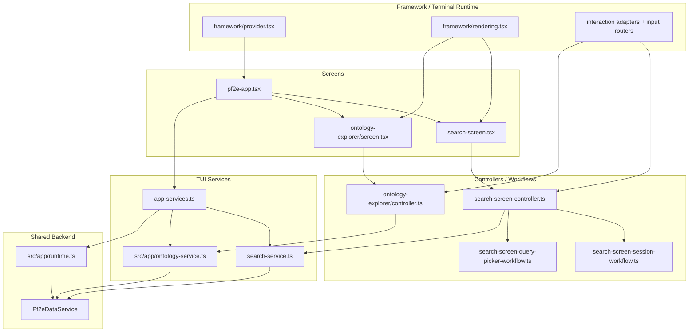

# TUI Architecture

This document describes how the terminal UI is assembled, where its boundaries live, and how it reuses the same backend runtime as the MCP server without pulling terminal concerns into shared services.

## What The TUI Owns

The TUI in `src/tui/` is a separate presentation surface over the same prepared PF2E index and search runtime used elsewhere in the repository.

Its job is to own:

- terminal rendering and input handling
- screen state, workflow state, and interaction routing
- user-facing search editing and ontology navigation flows
- editorial workbench entrypoints for tag-review tasks

It should not own:

- SQLite lifecycle management
- search ranking internals
- ontology domain construction
- normalized catalog access

Those responsibilities stay below the TUI behind app-layer and backend facades.

## Composition Root

`src/tui/app-services.ts` is the TUI composition root. It builds a terminal-oriented service bundle from the shared application runtime:

- `loadPf2eApplicationRuntime()` from `src/app/runtime.ts` loads config and the long-lived `Pf2eDataService`
- `createPf2eApplicationStorageService()` supplies app-scoped storage helpers for workflows that need direct index access
- `createPf2eApplicationOntologyService()` builds cached ontology domains for browsing
- `createPf2eTerminalSearchService()` adapts shared catalog/search capabilities into a TUI-facing query/session API
- the derived-tag workbench services are wired in as a development/editorial area, not mixed into the user search and ontology APIs

That gives the terminal app one explicit dependency object, `Pf2eTerminalAppServices`, with a clear split:

- `catalog`: the shared backend catalog facade backed by `Pf2eDataService`
- `user`: TUI-facing services for ontology and search
- `dev`: editorial workbench services

## Runtime Flow

```mermaid
flowchart TD
  Entry["`runPf2eTerminalApp()`\n`src/tui/pf2e-app.tsx`"] --> Framework["Ink runtime + `DerivedTagTerminalProvider`\n`src/tui/framework/provider.tsx`"]
  Framework --> Bootstrap["`Pf2eTerminalBootstrap`"]
  Bootstrap --> Load["`loadPf2eTerminalAppServices(argv)`\n`src/tui/app-services.ts`"]

  Load --> Runtime["`loadPf2eApplicationRuntime()`\n`src/app/runtime.ts`"]
  Runtime --> Config["App config"]
  Runtime --> Data["`Pf2eDataService`"]

  Load --> Storage["`createPf2eApplicationStorageService()`"]
  Load --> Ontology["`createPf2eApplicationOntologyService(config, dataService, storage)`"]
  Load --> Search["`createPf2eTerminalSearchService(...)`"]
  Load --> Dev["Derived-tag workbench services"]

  Data --> Search
  Data --> Ontology
  Storage --> Ontology
  Storage --> Dev

  Load --> App["`Pf2eTerminalApp`"]
  App --> Context["`Pf2eTerminalAppServicesProvider`"]
  Context --> Screens["Area menu, Search screen,\nOntology explorer, Tag workflows"]
```

The important architectural point is that the TUI does not rebuild backend logic. It composes shared services once, then keeps terminal behavior local to the screen tree.

## Shared Backend, Local UI

The TUI shares backend services in two ways:

- `catalog` is the same `Pf2eDataService` facade pattern used by the rest of the application
- ontology browsing is built from the same app-layer ontology service used to assemble readonly domain models

But the TUI keeps UI concerns local:

- `Pf2eTerminalApp` owns route-stack state and area transitions
- screen controllers own transient selection, pane focus, and detail-scroll state
- workflows own prompt flows, modal handoffs, session cleanup, and live-count/result-window behavior
- framework modules own Ink-specific rendering, modal hosting, terminal sizing, and raw input normalization

This split matters because it lets the TUI add richer interaction behavior without pushing terminal concepts like pane focus, command palettes, or staged editors down into `src/app/`, `src/data/`, or `src/search/`.

## Major TUI Layers

### Framework Layer

`src/tui/framework/` contains the terminal mechanics:

- Ink provider lifecycle in `framework/provider.tsx`
- rendering primitives in `framework/rendering.tsx`
- input and navigation helpers in `framework/input.ts`
- terminal context in `framework/context.ts`
- modal hosting and prompt plumbing in `framework/modal.tsx`

Feature code should build on these helpers instead of importing raw terminal primitives directly.

### App Services Layer

`src/tui/app-services.ts` and `src/tui/app-service-context.tsx` define what the terminal app can use. This keeps most screens from knowing how runtime assembly works.

The service context is intentionally narrow: screens ask for `services.user.search` or `services.user.ontology`, not for direct storage or low-level query helpers.

### Search Service Layer

`src/tui/search-service.ts` is the TUI-facing facade over search behavior. It is not the ranking engine itself. Instead, it:

- normalizes query state into `SearchFilters`
- exposes category, subcategory, sort, and facet options for the UI
- converts ontology-origin queries into TUI query state
- opens and reads search windows through the shared backend
- owns TUI session concepts such as result buffers, sort changes, and session disposal

This keeps query editing and result reading logic in the TUI while leaving search execution in shared backend services.

### Ontology Explorer Layer

`src/tui/ontology-explorer/` is a feature-local stack for browsing ontology domain models. Its controller and UI logic stay inside the TUI because they are about navigation behavior, not ontology assembly.

The explorer consumes readonly domain models from `src/app/ontology-service.ts`, then adds:

- browser snapshots for restoring navigation state
- two-pane navigation and detail scrolling
- ontology command palettes and picker hosting
- launching search queries from selected ontology nodes

## Screen, Workflow, And Controller Split

The TUI generally separates visible screens from stateful interaction logic and service calls.



In practice, the responsibilities break down like this:

- screens choose which visual shell to render and pass callbacks around
- controllers derive screen props from state, terminal size, and selected services
- workflows handle async tasks, prompts, cleanup, and multi-step editing flows
- services translate TUI intent into app/backend operations

That split keeps most feature files from mixing rendering code, terminal event interpretation, and backend access in the same module.

## Search Screen As The Best Example

The search flow shows the intended layering most clearly.

`src/tui/search-screen.tsx` is thin. It decides whether to render:

- the normal search screen
- an ontology-backed picker session
- a structured editor session

`src/tui/search-screen-controller.ts` is the orchestration layer. It:

- pulls `user.search` from the app-service context
- creates the reducer-backed screen state
- derives pane sizes and detail lines from terminal dimensions
- coordinates result sessions, structured editor sessions, and ontology-backed field pickers
- installs the search interaction router

The async work is pushed further down:

- `search-screen-session-workflow.ts` manages live counts, result-window execution, prefetch, sort changes, and session disposal
- `search-screen-query-picker-workflow.ts` hosts ontology-backed field picking for structured search editing
- `search-screen-interactions.ts` maps state into terminal actions and help/command models

This is the pattern to preserve when the TUI grows: keep rendering, workflow state, and backend calls separate enough that each layer can change without forcing a full rewrite of the others.

## Design Rules To Preserve

- Treat `src/tui/app-services.ts` as the TUI composition root. Do not let screens assemble runtime dependencies ad hoc.
- Keep Ink and terminal-framework details in `src/tui/framework/` and shared interaction helpers.
- Route search behavior through `src/tui/search-service.ts` instead of letting screens call backend search APIs directly.
- Treat ontology models from `src/app/ontology-service.ts` as shared readonly inputs; navigation state belongs in the TUI.
- Prefer controllers and workflows for stateful interaction logic; keep screen components mostly declarative.
- When a new TUI abstraction becomes the mandatory path, add or extend lint rules so the boundary is enforced rather than implied.
